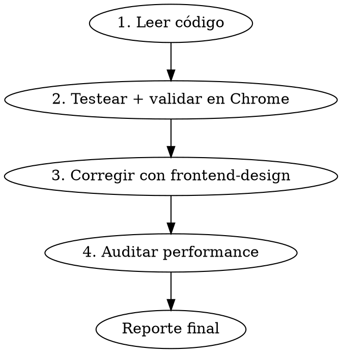

# Testear — Verificación funcional + visual + performance en el navegador

## Overview

Proceso completo de verificación de un módulo/sección de ORVIT en el navegador usando Chrome DevTools MCP. Cubre 4 fases obligatorias: lectura de código, testing funcional + validación visual en Chrome, corrección de inconsistencias con frontend-design, y auditoría de performance con vercel-react-best-practices.

## Flujo obligatorio

**NUNCA saltear fases. NUNCA empezar a clickear sin haber leído el código primero.**

---

## Fase 1 — Leer todo el código de la sección

**Objetivo:** Conocer TODAS las funcionalidades antes de tocar Chrome.

1. **Identificar la sección** — El usuario indica qué módulo/página testear (ej: "agenda", "ventas/cobranzas", "mantenimiento/checklists")
2. **Leer componentes** — Usar `Agent Explore` si hay >10 archivos, o leer directamente si son pocos:
   - Todos los componentes del módulo (`components/{modulo}/`)
   - La página principal (`app/{ruta}/page.tsx`)
   - Layouts relevantes (`app/{ruta}/layout.tsx`)
3. **Leer endpoints API** — Todos los `app/api/` relacionados al módulo
4. **Leer el design system** — Leer `docs/rules/design-system.md` completo para saber qué validar visualmente
5. **Crear checklist** — Anotar CADA funcionalidad testeable usando `TaskCreate`:
   - CRUD de cada entidad (crear, leer, editar, eliminar)
   - Cambios de estado (status, prioridad, asignación)
   - Acciones especiales (duplicar, completar, bulk actions)
   - Todas las vistas/modos (kanban, lista, grilla, dashboard, etc.)
   - Filtros, búsqueda, ordenamiento
   - Interacciones (drag-and-drop, inline edit, modales, sheets)
   - Elementos secundarios (subtareas, comentarios, adjuntos)
   - Empty states y edge cases

**Resultado:** Checklist completa de funcionalidades en TaskCreate + design system leído.

---

## Fase 2 — Testear funcionalidad + validar frontend en Chrome

**Objetivo:** Verificar que cada funcionalidad funciona Y que el frontend es visualmente consistente con el design system. Todo en la misma pasada con Chrome DevTools MCP.

### Credenciales

Las credenciales de login están en `docs/credenciales.md`. Leer ese archivo antes de iniciar sesión.

### Proceso

1. **Navegar** a la URL de la sección con `navigate_page`
2. **Login** si es necesario (usar `fill_form` con credenciales de `docs/credenciales.md`)
3. **Por cada vista/página del módulo:**
   - Tomar `take_snapshot` para obtener los UIDs de los elementos
   - Tomar `take_screenshot` y analizar visualmente contra el design system:
     - **Colores:** ¿Usa los tokens correctos? (status, prioridad, neutrals)
     - **Tipografía:** ¿Tamaños y weights correctos? (títulos, body, labels)
     - **Espaciado:** ¿Padding y gaps consistentes? (cards, inputs, botones)
     - **Bordes y sombras:** ¿Border radius y shadows correctos?
     - **Componentes:** ¿Usa shadcn/ui estándar?
     - **Empty states:** ¿Tiene empty state con icono + mensaje + CTA?
     - **Loading states:** ¿Muestra spinner/skeleton?
     - **Feedback:** ¿Toast para confirmaciones? ¿AlertDialog para destructivos?
   - Anotar inconsistencias visuales encontradas
4. **Por cada funcionalidad del checklist:**
   - Ejecutar la acción (click, fill, drag, etc.)
   - Verificar resultado esperado
   - Tomar `take_screenshot` en pasos críticos como evidencia
   - Revisar `list_console_messages` filtrado por `["error", "warn"]`
   - Revisar `list_network_requests` filtrado por `["fetch", "xhr"]` buscando 4xx/5xx
   - Si hay error: inspeccionar con `get_network_request` o `get_console_message`
   - Marcar el task como completado o fallido
5. **Si algo falla:** investigar, diagnosticar y **arreglar ANTES de continuar**
6. **Cleanup:** al terminar, eliminar datos de prueba creados durante el testing

### Herramientas Chrome DevTools MCP clave

| Herramienta | Uso |
|-------------|-----|
| `take_snapshot` | Obtener árbol de elementos con UIDs (usar ANTES de interactuar) |
| `take_screenshot` | Captura visual — para evidencia Y para validar design system |
| `click` | Click en elemento por UID |
| `fill` / `fill_form` | Llenar inputs/formularios |
| `navigate_page` | Navegar a URL, reload, back/forward |
| `list_console_messages` | Buscar errores JS |
| `list_network_requests` | Buscar requests fallidos |
| `get_network_request` | Inspeccionar request específico |
| `press_key` | Simular teclas (Enter, Escape, Tab) |
| `wait_for` | Esperar elemento o condición |

**Resultado:** Funcionalidades verificadas + lista de inconsistencias visuales.

---

## Fase 3 — Corregir con el plugin frontend-design

**Objetivo:** Arreglar todas las inconsistencias visuales encontradas en la Fase 2.

1. **Invocar el plugin** `frontend-design:frontend-design` (NO es un skill normal — es un plugin que se invoca con `Skill tool → frontend-design:frontend-design`)
2. **Pasar las inconsistencias** encontradas en la Fase 2 como input al plugin
3. **Seguir las instrucciones del plugin** para aplicar correcciones — el plugin genera código de alta calidad visual y evita estética genérica
4. **Verificar cada fix** en Chrome con `take_screenshot` después de cada cambio
5. **No sobre-diseñar** — Solo corregir inconsistencias y mejoras claras, no rediseñar desde cero

**Resultado:** Código corregido, verificado visualmente en Chrome.

---

## Fase 4 — Auditar performance con Vercel Best Practices

**Objetivo:** Revisar y optimizar el código del módulo según las mejores prácticas de React/Next.js.

1. **Invocar** el skill `vercel-react-best-practices` con: `Skill tool → vercel-react-best-practices`
2. **Revisar el código** del módulo buscando violaciones en orden de prioridad:
   - **CRITICAL:** Waterfalls (await secuenciales) → `Promise.all()`
   - **CRITICAL:** Bundle size (imports pesados sin `next/dynamic`)
   - **HIGH:** Server-side (cache, serialización, parallel fetching)
   - **MEDIUM:** Re-renders (useState+useEffect para derivados → useMemo, default `= []` → constante)
   - **MEDIUM:** Rendering (content-visibility, conditional render)
   - **LOW-MEDIUM:** JS (combinación de iteraciones, sort-for-max → reduce)
3. **Aplicar fixes** para cada violación encontrada
4. **Verificar** que los fixes no rompieron funcionalidad (reload en Chrome, check console errors)

**Resultado:** Código optimizado para performance.

---

## Reporte final

Al completar las 4 fases, generar un resumen con:

| Fase | Resultado |
|------|-----------|
| 1. Lectura | X componentes, Y endpoints leídos |
| 2. Chrome (funcional + visual) | X/Y tests pasaron, Z bugs fixeados, W inconsistencias visuales encontradas |
| 3. Frontend fixes | X correcciones de diseño aplicadas |
| 4. Performance | X optimizaciones aplicadas |

---

## Anti-patterns

- **NO** empezar a clickear sin haber leído el código (Fase 1 es obligatoria)
- **NO** testear solo lo obvio — cubrir TODAS las funcionalidades del checklist
- **NO** ignorar errores de consola o network — cada error se investiga
- **NO** validar visualmente sin tomar screenshots — siempre capturar evidencia
- **NO** saltear el cleanup de datos de prueba
- **NO** aplicar mejoras de diseño sin verificar en Chrome después
- **NO** saltear fases — las 4 son obligatorias y en orden
