# ERD Overview

> High-level entity relationship diagram by category

## 🤖 AI

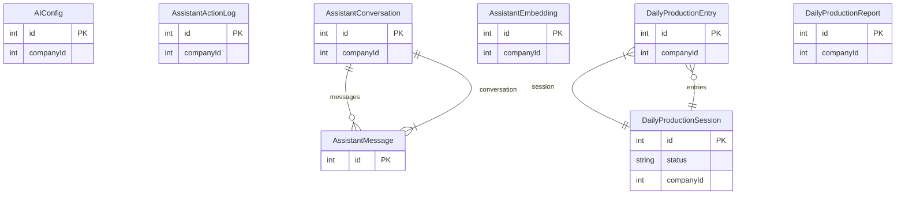

## 🔐 Auth

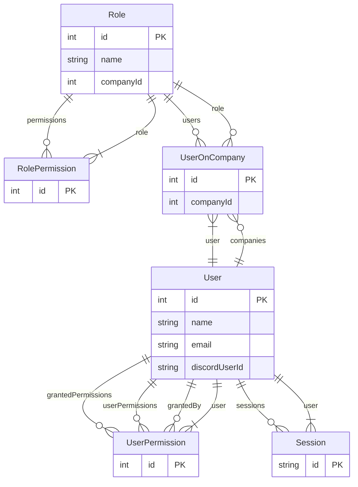

## ⚙️ Automation

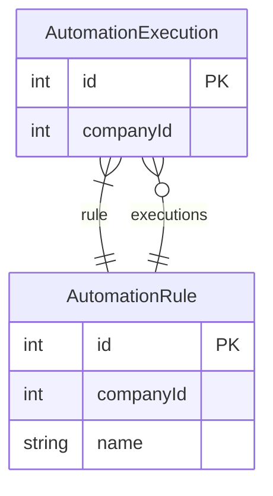

## 💳 Billing

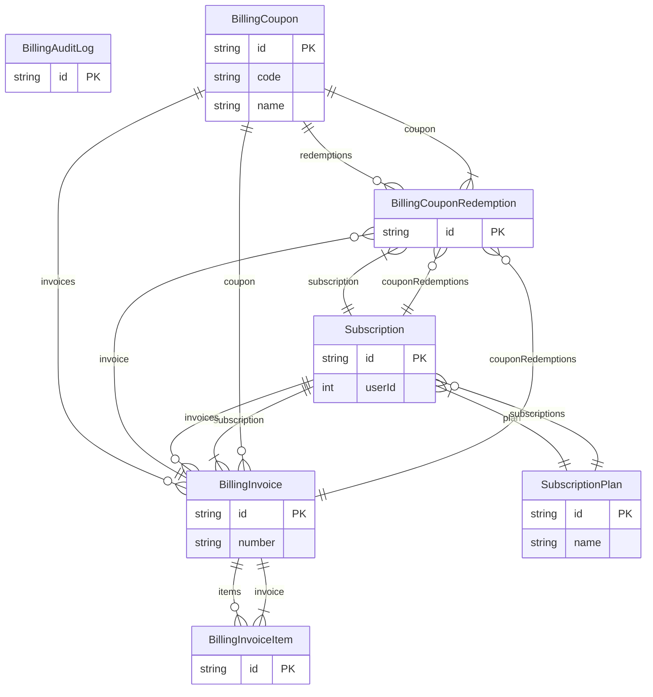

## 🏢 Core

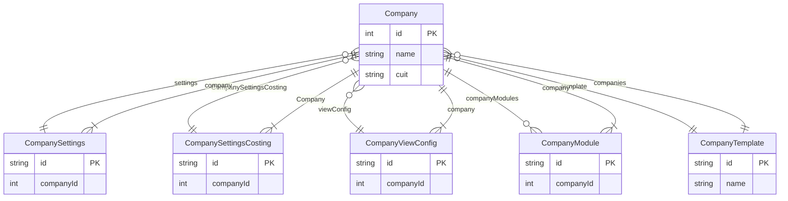

## 💰 Costs

> Too many models (36) for a single diagram. See individual model pages.

Models: `cost_distribution_config`, `CostCenter`, `CostEmployee`, `CostParam`, `CostProduct`, `CostSystemConfig`, `CostVarianceMonthly`, `employee_cost_distribution`, `indirect_cost_base`, `indirect_cost_categories`, `indirect_cost_change_history`, `indirect_cost_history`, `indirect_cost_monthly_records`, `indirect_costs`, `IndirectItem`, `IndirectItemAllocation`, `IndirectItemAllocationMonthly`, `IndirectPriceHistory`, `InputItem`, `InputPriceHistory`, `MonthlyCostConsolidation`, `MonthlyIndirect`, `MonthlyProduction`, `PayrollInput`, `ProductCostHistory`, `ProductCostLog`, `ProductionMethod`, `ProductStandardCost`, `Recipe`, `recipe_change_history`, `recipe_cost_tests`, `recipe_items`, `RecipeItem`, `recipes`, `TechnicianCostRate`, `ThirdPartyCost`

## 📊 Dashboard

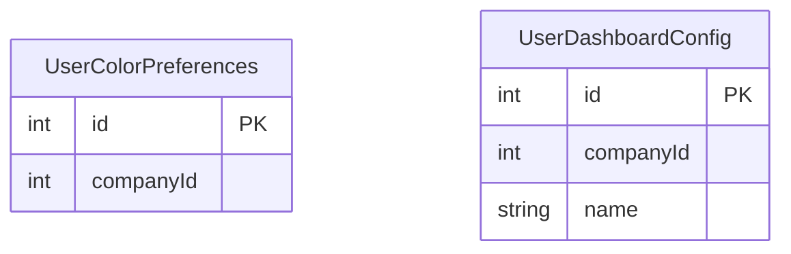

## 📎 Documents

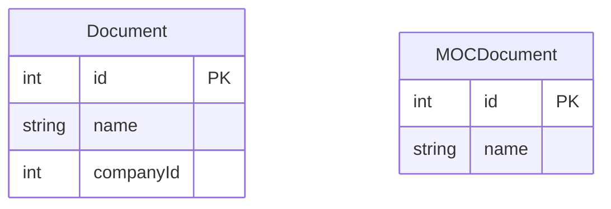

## 💡 Ideas

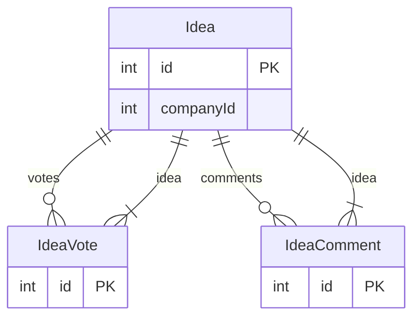

## 💬 Integrations

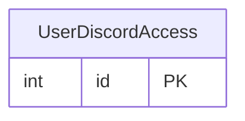

## 🚛 Logistics

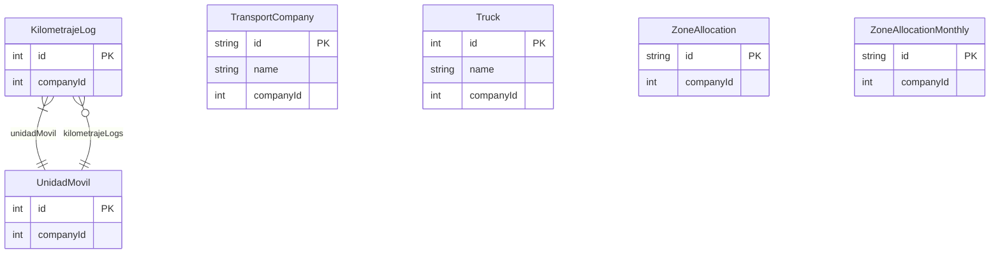

## 🔧 Maintenance

> Too many models (60) for a single diagram. See individual model pages.

Models: `ActivityEvent`, `checklist_executions`, `checklist_items`, `ChecklistExecution`, `ChecklistInstructive`, `ClientPortalActivity`, `Component`, `ComponentFailureMode`, `ComponentTool`, `CorrectiveChecklistTemplate`, `CorrectiveSettings`, `CounterMaintenanceTrigger`, `DowntimeLog`, `EmployeeSalaryComponent`, `Failure`, `FailureOccurrence`, `FailureOccurrenceComment`, `FailureOccurrenceEvent`, `FailureSolution`, `FailureWatcher`, `GremioCategoryTemplate`, `GremioTemplate`, `LOTOExecution`, `LOTOProcedure`, `Machine`, `machine_order_temp`, `MachineCounter`, `MachineCounterReading`, `MachineImportFile`, `MachineImportFileAnalysis`, `MachineImportJob`, `MachineOrder`, `maintenance_configs`, `maintenance_history`, `MaintenanceBudget`, `MaintenanceChecklist`, `MaintenanceCostBreakdown`, `PermitToWork`, `ProductionDowntime`, `ProductionQualityControl`, `ProductionRoutineTemplate`, `QualityAssurance`, `RootCauseAnalysis`, `SalaryComponent`, `SolutionApplication`, `SolutionApplied`, `SparePartReservation`, `SymptomLibrary`, `Template`, `ToolMachine`, `VoiceFailureLog`, `WorkOrder`, `WorkOrderAttachment`, `WorkOrderChecklist`, `WorkOrderComment`, `WorkOrderWatcher`, `WorkStation`, `WorkStationComponent`, `WorkStationInstructive`, `WorkStationMachine`

## 🔔 Notifications

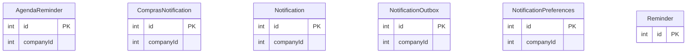

## 🏗️ Organization

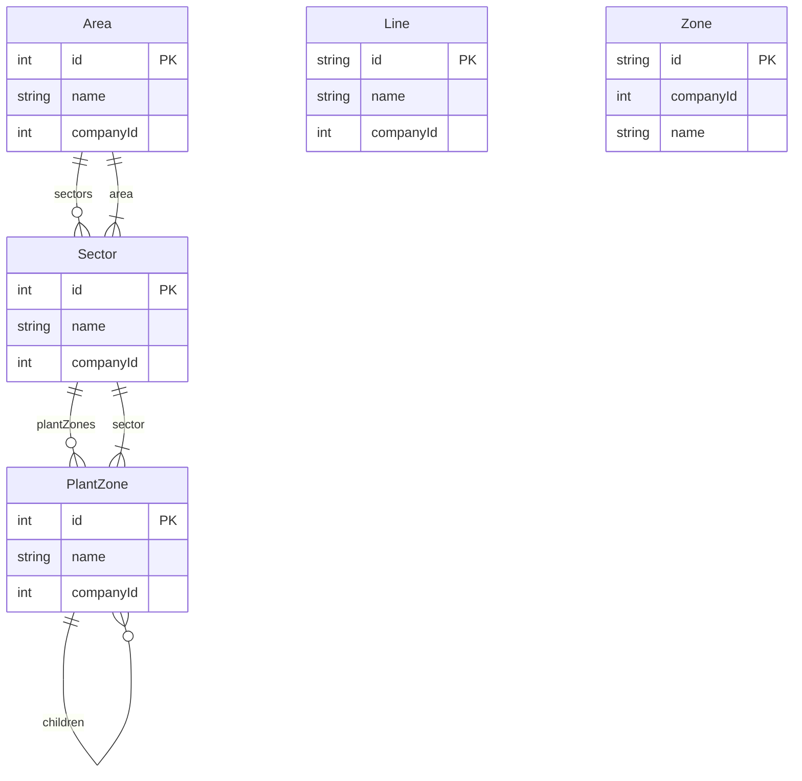

## 📁 Other

> Too many models (82) for a single diagram. See individual model pages.

Models: `AdvanceInstallment`, `AgendaTask`, `ApprovalAction`, `ApprovalDelegation`, `ApprovalInstance`, `ApprovalWorkflow`, `ApprovalWorkflowLevel`, `AttendanceEvent`, `AuditLog`, `BatchRun`, `BusinessSector`, `ChatMessage`, `ChatSession`, `Client`, `ClientPriceList`, `CompanyQuotationSettings`, `Contact`, `ContactInteraction`, `CreditDebitNoteItem`, `CreditNoteRequest`, `CreditNoteRequestItem`, `CuringRecord`, `Despacho`, `DespachoItem`, `DevolucionMaterial`, `DevolucionMaterialItem`, `DuplicateDetection`, `FactPnLMonthly`, `FactSalesMonthly`, `GeneralConfig`, `GlobalAllocation`, `GRNIAccrual`, `HistoryEvent`, `IntegrationConfig`, `InterventionKit`, `InventoryLot`, `LoginAttempt`, `LotInstallation`, `ManagementOfChange`, `MaterialRequest`, `MaterialRequestItem`, `MethodConversion`, `MethodProductYield`, `MOCHistory`, `MOCTask`, `Module`, `monthly_production`, `monthly_sales`, `Permission`, `PermissionAuditLog`, `PerUnitBOM`, `PrestressedMold`, `Project`, `QuotationStatusHistory`, `RateLimitEntry`, `RefreshToken`, `ReplenishmentSuggestion`, `SecurityEvent`, `SellerKPI`, `ServiceContract`, `ServiceContractAlert`, `Stock`, `StockLocation`, `StockMovement`, `StockReservation`, `Subtask`, `supplies`, `supply_monthly_prices`, `supply_price_history`, `SupplyCategory`, `TokenBlacklist`, `TokenTransaction`, `TrustedDevice`, `UnionCategory`, `UserTwoFactor`, `ViewModeLog`, `VoiceTaskLog`, `VolumetricParam`, `WorkCenter`, `WorkLog`, `WorkShift`, `YieldConfig`

## 💼 Payroll

> Too many models (24) for a single diagram. See individual model pages.

Models: `AgreementRate`, `CompanyHoliday`, `Employee`, `employee_distribution_config`, `employee_monthly_salaries`, `employee_salary_history_new`, `EmployeeCategory`, `EmployeeCompHistory`, `EmployeeFixedConcept`, `EmployeeSalaryHistory`, `Payroll`, `PayrollAuditLog`, `PayrollConfig`, `PayrollItem`, `PayrollItemLine`, `PayrollPeriod`, `PayrollRun`, `PayrollRunItem`, `PayrollRunItemLine`, `PayrollUnion`, `PayrollVariableConcept`, `SalaryAdvance`, `WorkPosition`, `WorkSector`

## 🌐 Portal

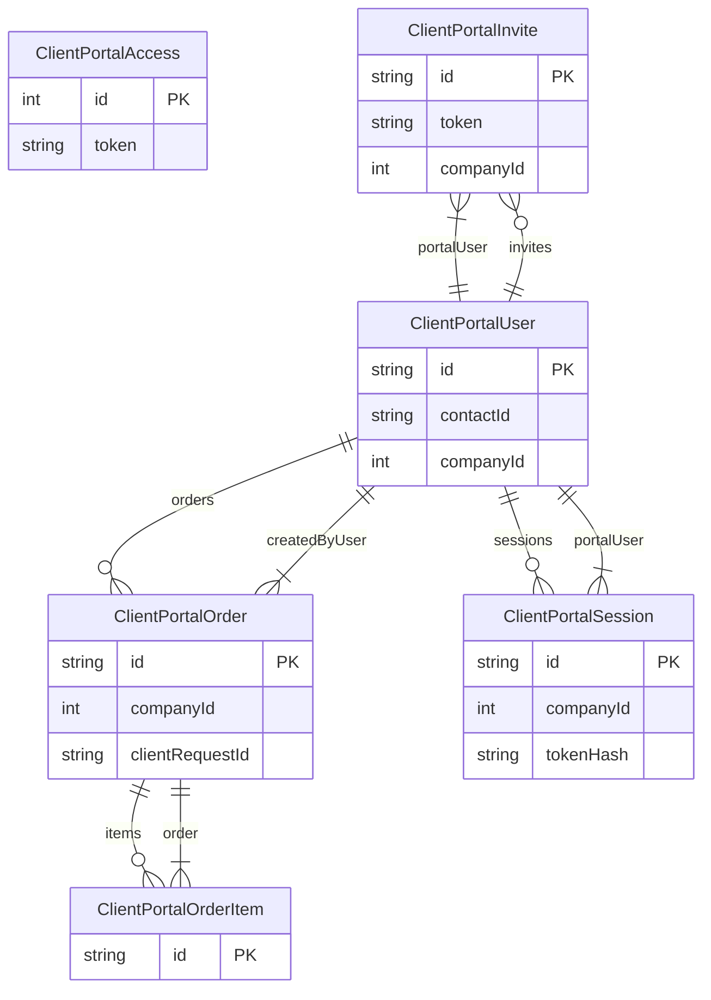

## 📦 Products

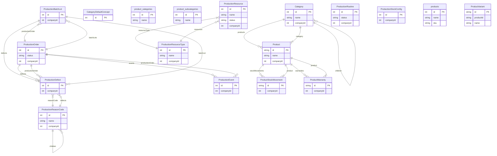

## 🛍️ Purchases

> Too many models (45) for a single diagram. See individual model pages.

Models: `CreditDebitNote`, `FactPurchasesMonthly`, `GoodsReceipt`, `GoodsReceiptItem`, `InventoryItemSupplier`, `MatchException`, `MatchExceptionHistory`, `MatchExceptionSLAConfig`, `MatchLineResult`, `MatchResult`, `PurchaseAccount`, `PurchaseAdvancedConfig`, `PurchaseApproval`, `PurchaseAuditLog`, `PurchaseComment`, `PurchaseConfig`, `PurchaseOrder`, `PurchaseOrderItem`, `PurchaseQuotation`, `PurchaseQuotationItem`, `PurchaseReceipt`, `PurchaseReceiptItem`, `PurchaseRequest`, `PurchaseRequestItem`, `PurchaseReturn`, `PurchaseReturnItem`, `RecurringPurchaseHistory`, `RecurringPurchaseItem`, `RecurringPurchaseOrder`, `SoDRule`, `SoDViolation`, `StockAdjustment`, `StockAdjustmentItem`, `StockTransfer`, `StockTransferItem`, `SupplierAccountMovement`, `SupplierChangeRequest`, `SupplierCreditAllocation`, `SupplierItem`, `SupplierItemAlias`, `SupplierLeadTime`, `suppliers`, `UserWarehouseScope`, `VoicePurchaseLog`, `Warehouse`

## 🛒 Sales

> Too many models (53) for a single diagram. See individual model pages.

Models: `AcopioRetiro`, `AcopioRetiroItem`, `ClientBalanceSnapshot`, `ClientBlockHistory`, `ClientContact`, `ClientDiscount`, `ClientLedgerEntry`, `ClientNote`, `ClientType`, `CollectionAttempt`, `DeliveryZone`, `DiscountList`, `DiscountListProduct`, `DiscountListRubro`, `InvoicePaymentAllocation`, `Load`, `LoadItem`, `LoadOrder`, `LoadOrderItem`, `PriceComparison`, `PriceComparisonCompetitor`, `PriceComparisonProductPrice`, `PriceHistory`, `Quote`, `QuoteAcceptance`, `QuoteAttachment`, `QuoteItem`, `QuoteVersion`, `Sale`, `SaleAcopio`, `SaleAcopioItem`, `SaleDelivery`, `SaleDeliveryEvidence`, `SaleDeliveryItem`, `SaleItem`, `SaleRemito`, `SaleRemitoItem`, `SaleRMA`, `SaleRMAHistory`, `SaleRMAItem`, `SalesApproval`, `SalesAuditLog`, `SalesConfig`, `SalesCreditDebitNote`, `SalesCreditDebitNoteItem`, `SalesGoal`, `SalesGoalProgress`, `SalesInvoice`, `SalesInvoiceItem`, `SalesPerformanceDashboard`, `SalesPriceList`, `SalesPriceListItem`, `SalesPriceLog`

## 📋 Tasks

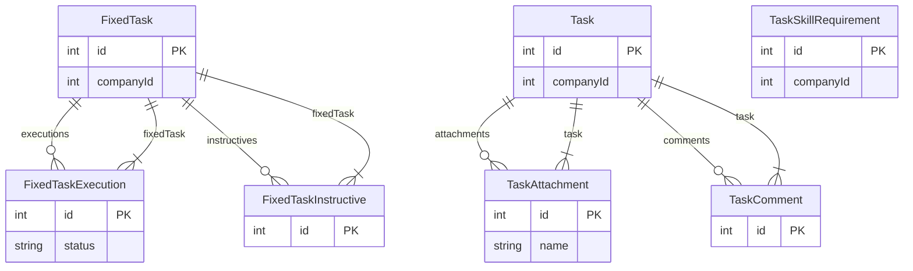

## 📑 Tax

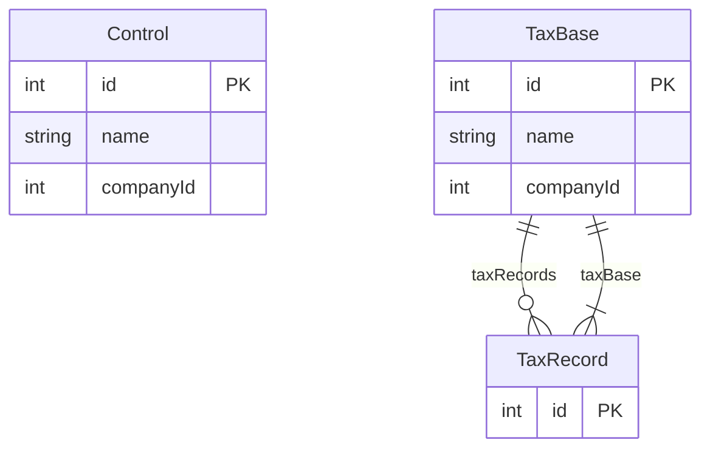

## 🔨 Tools

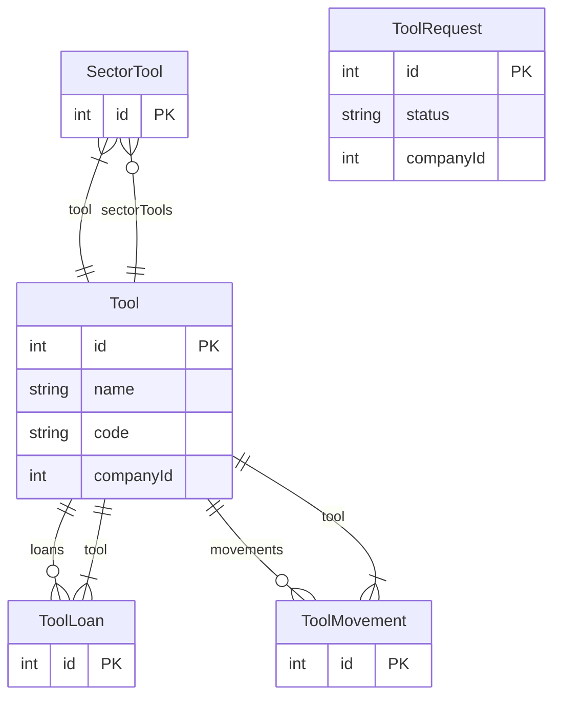

## 🏦 Treasury

> Too many models (23) for a single diagram. See individual model pages.

Models: `BankAccount`, `BankMovement`, `BankStatement`, `BankStatementItem`, `BillingAutoPaymentConfig`, `BillingPayment`, `CashAccount`, `CashMovement`, `Cheque`, `ClientPayment`, `ClientPaymentCheque`, `IdempotencyKey`, `PaymentOrder`, `PaymentOrderAttachment`, `PaymentOrderCheque`, `PaymentOrderReceipt`, `PaymentRequest`, `PaymentRequestLog`, `PaymentRequestReceipt`, `ServicePayment`, `TreasuryConfig`, `TreasuryMovement`, `TreasuryTransfer`

## 👷 Workers

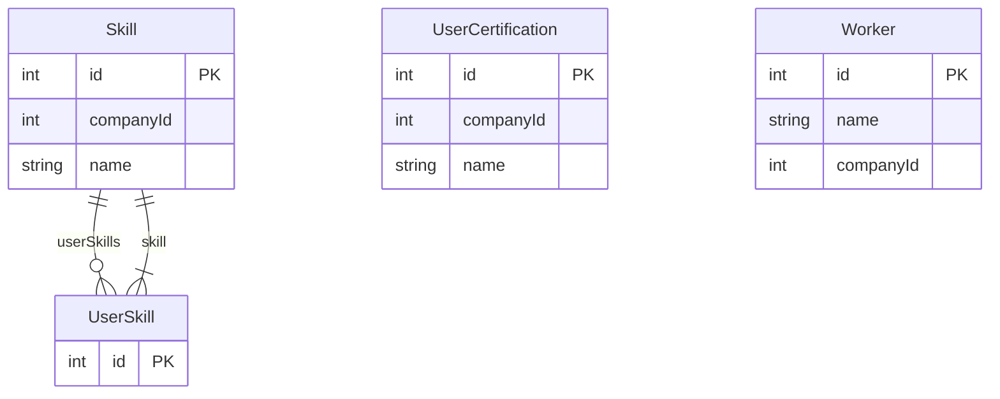

