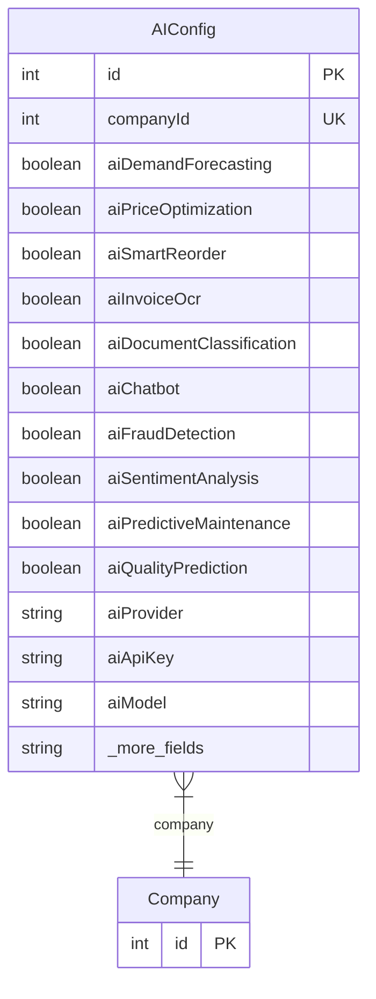

# AIConfig

> Table name: `ai_config`

**Schema location:** Lines 15390-15437

## Fields

| Field | Type | Required | Unique | Default | Notes |
|-------|------|----------|--------|---------|-------|
| `id` | `Int` | ✅ | 🔑 PK | `autoincrement(` |  |
| `companyId` | `Int` | ✅ | ✅ | `` |  |
| `aiDemandForecasting` | `Boolean` | ✅ |  | `false` | Funcionalidades de IA habilitadas |
| `aiPriceOptimization` | `Boolean` | ✅ |  | `false` |  |
| `aiSmartReorder` | `Boolean` | ✅ |  | `false` |  |
| `aiInvoiceOcr` | `Boolean` | ✅ |  | `false` |  |
| `aiDocumentClassification` | `Boolean` | ✅ |  | `false` |  |
| `aiChatbot` | `Boolean` | ✅ |  | `false` |  |
| `aiFraudDetection` | `Boolean` | ✅ |  | `false` |  |
| `aiSentimentAnalysis` | `Boolean` | ✅ |  | `false` |  |
| `aiPredictiveMaintenance` | `Boolean` | ✅ |  | `false` |  |
| `aiQualityPrediction` | `Boolean` | ✅ |  | `false` |  |
| `aiProvider` | `String` | ✅ |  | `"OPENAI"` | DB: VarChar(50). Configuración general de IA |
| `aiApiKey` | `String?` | ❌ |  | `` | DB: VarChar(500) |
| `aiModel` | `String` | ✅ |  | `"gpt-4"` | DB: VarChar(100) |
| `forecastPeriodoDias` | `Int` | ✅ |  | `90` | Configuración Demand Forecasting |
| `forecastAutoAjusteStock` | `Boolean` | ✅ |  | `false` |  |
| `priceOptimizationObjetivo` | `String` | ✅ |  | `"MARGEN"` | DB: VarChar(50). Configuración Price Optimization |
| `priceOptimizationCompetenciaEnabled` | `Boolean` | ✅ |  | `false` |  |
| `ocrAutoProcesamiento` | `Boolean` | ✅ |  | `false` | Configuración OCR |
| `ocrRequiereValidacion` | `Boolean` | ✅ |  | `true` |  |
| `chatbotIdiomas` | `String?` | ❌ |  | `"es,en"` | Configuración Chatbot |
| `chatbotHorarioDisponible` | `String?` | ❌ |  | `` | DB: VarChar(100) |
| `fraudScoreThreshold` | `Decimal` | ✅ |  | `0.75` | DB: Decimal(5, 2). Configuración Fraud Detection |
| `fraudAutoBloqueo` | `Boolean` | ✅ |  | `false` |  |
| `createdAt` | `DateTime` | ✅ |  | `now(` |  |
| `updatedAt` | `DateTime` | ✅ |  | `` |  |

## Relations

| Field | Type | Cardinality | FK Fields | References | On Delete |
|-------|------|-------------|-----------|------------|-----------|
| `company` | [Company](./models/Company.md) | Many-to-One | companyId | id | Cascade |

## Referenced By

| Model | Field | Cardinality |
|-------|-------|-------------|
| [Company](./models/Company.md) | `aiConfig` | Has one |

## Entity Diagram

