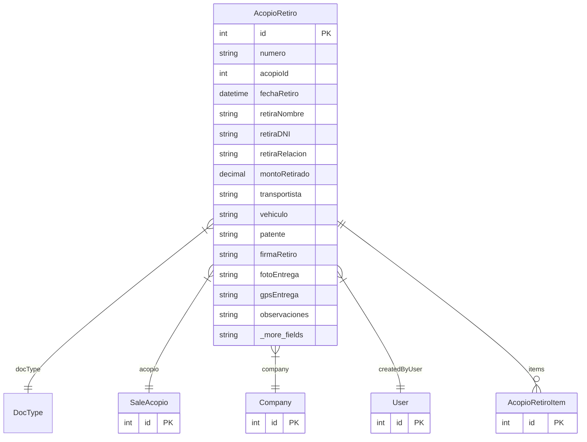

# AcopioRetiro

> Table name: `acopio_retiros`

**Schema location:** Lines 10524-10571

## Fields

| Field | Type | Required | Unique | Default | Notes |
|-------|------|----------|--------|---------|-------|
| `id` | `Int` | ✅ | 🔑 PK | `autoincrement(` |  |
| `numero` | `String` | ✅ |  | `` | DB: VarChar(50) |
| `acopioId` | `Int` | ✅ |  | `` |  |
| `fechaRetiro` | `DateTime` | ✅ |  | `` | DB: Date. Fecha |
| `retiraNombre` | `String?` | ❌ |  | `` | DB: VarChar(255). Datos de quien retira |
| `retiraDNI` | `String?` | ❌ |  | `` | DB: VarChar(20) |
| `retiraRelacion` | `String?` | ❌ |  | `` | DB: VarChar(100). "Titular", "Empleado", "Transportista" |
| `montoRetirado` | `Decimal` | ✅ |  | `` | DB: Decimal(15, 2). Monto |
| `transportista` | `String?` | ❌ |  | `` | DB: VarChar(255). Transporte |
| `vehiculo` | `String?` | ❌ |  | `` | DB: VarChar(100) |
| `patente` | `String?` | ❌ |  | `` | DB: VarChar(20) |
| `firmaRetiro` | `String?` | ❌ |  | `` | Base64 o URL de firma digital |
| `fotoEntrega` | `String?` | ❌ |  | `` | URL de foto |
| `gpsEntrega` | `String?` | ❌ |  | `` | DB: VarChar(100). Coordenadas |
| `observaciones` | `String?` | ❌ |  | `` |  |
| `companyId` | `Int` | ✅ |  | `` | Tracking |
| `createdBy` | `Int` | ✅ |  | `` |  |
| `createdAt` | `DateTime` | ✅ |  | `now(` |  |
| `updatedAt` | `DateTime` | ✅ |  | `` |  |

## Relations

| Field | Type | Cardinality | FK Fields | References | On Delete |
|-------|------|-------------|-----------|------------|-----------|
| `docType` | [DocType](./models/DocType.md) | Many-to-One | - | - | - |
| `acopio` | [SaleAcopio](./models/SaleAcopio.md) | Many-to-One | acopioId | id | Cascade |
| `company` | [Company](./models/Company.md) | Many-to-One | companyId | id | Cascade |
| `createdByUser` | [User](./models/User.md) | Many-to-One | createdBy | id | - |
| `items` | [AcopioRetiroItem](./models/AcopioRetiroItem.md) | One-to-Many | - | - | - |

## Referenced By

| Model | Field | Cardinality |
|-------|-------|-------------|
| [Company](./models/Company.md) | `acopioRetiros` | Has many |
| [User](./models/User.md) | `retirosCreated` | Has many |
| [SaleAcopio](./models/SaleAcopio.md) | `retiros` | Has many |
| [AcopioRetiroItem](./models/AcopioRetiroItem.md) | `retiro` | Has one |

## Indexes

- `acopioId`
- `companyId`
- `fechaRetiro`

## Unique Constraints

- `companyId, numero`

## Entity Diagram

