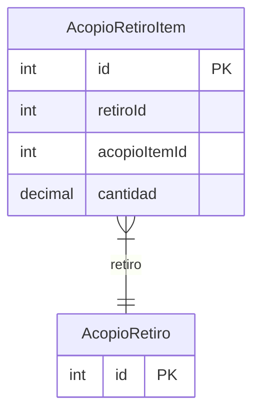

# AcopioRetiroItem

> Table name: `acopio_retiro_items`

**Schema location:** Lines 10574-10585

## Fields

| Field | Type | Required | Unique | Default | Notes |
|-------|------|----------|--------|---------|-------|
| `id` | `Int` | ✅ | 🔑 PK | `autoincrement(` |  |
| `retiroId` | `Int` | ✅ |  | `` |  |
| `acopioItemId` | `Int` | ✅ |  | `` |  |
| `cantidad` | `Decimal` | ✅ |  | `` | DB: Decimal(15, 4) |

## Relations

| Field | Type | Cardinality | FK Fields | References | On Delete |
|-------|------|-------------|-----------|------------|-----------|
| `retiro` | [AcopioRetiro](./models/AcopioRetiro.md) | Many-to-One | retiroId | id | Cascade |

## Referenced By

| Model | Field | Cardinality |
|-------|-------|-------------|
| [AcopioRetiro](./models/AcopioRetiro.md) | `items` | Has many |

## Indexes

- `retiroId`
- `acopioItemId`

## Entity Diagram

