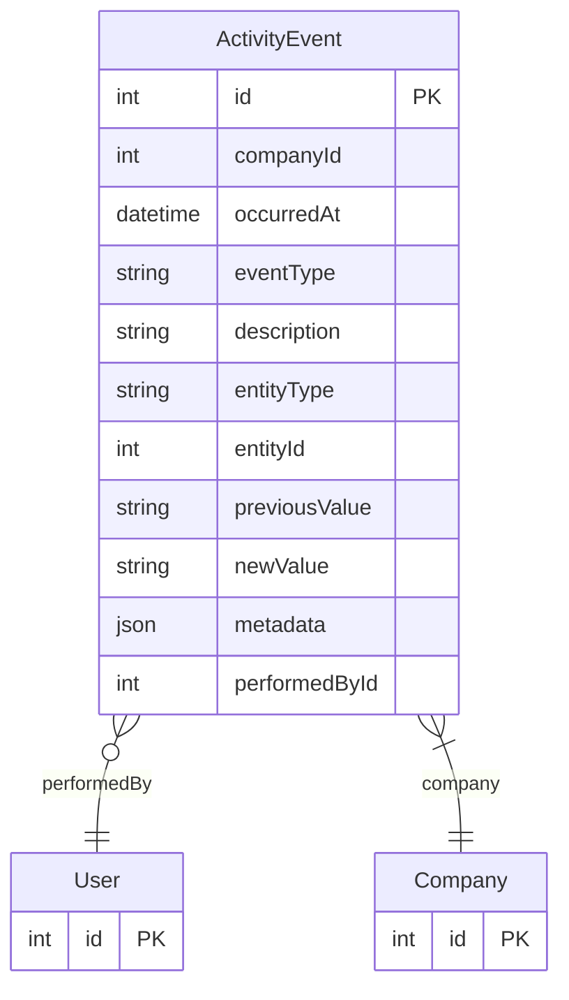

# ActivityEvent

> Table name: `activity_events`

**Schema location:** Lines 5853-5880

## Fields

| Field | Type | Required | Unique | Default | Notes |
|-------|------|----------|--------|---------|-------|
| `id` | `Int` | ✅ | 🔑 PK | `autoincrement(` |  |
| `companyId` | `Int` | ✅ |  | `` |  |
| `occurredAt` | `DateTime` | ✅ |  | `now(` |  |
| `eventType` | `String` | ✅ |  | `` | DB: VarChar(50). CREATED, STATUS_CHANGED, ASSIGNED, etc. |
| `description` | `String?` | ❌ |  | `` | DB: Text |
| `entityType` | `String` | ✅ |  | `` | DB: VarChar(30). FAILURE_OCCURRENCE | WORK_ORDER |
| `entityId` | `Int` | ✅ |  | `` |  |
| `previousValue` | `String?` | ❌ |  | `` | DB: VarChar(255). Datos del cambio |
| `newValue` | `String?` | ❌ |  | `` | DB: VarChar(255) |
| `metadata` | `Json?` | ❌ |  | `` | Datos adicionales del evento |
| `performedById` | `Int?` | ❌ |  | `` | Quién realizó la acción |

## Relations

| Field | Type | Cardinality | FK Fields | References | On Delete |
|-------|------|-------------|-----------|------------|-----------|
| `performedBy` | [User](./models/User.md) | Many-to-One (optional) | performedById | id | - |
| `company` | [Company](./models/Company.md) | Many-to-One | companyId | id | Cascade |

## Referenced By

| Model | Field | Cardinality |
|-------|-------|-------------|
| [Company](./models/Company.md) | `activityEvents` | Has many |
| [User](./models/User.md) | `activityEventsPerformed` | Has many |

## Indexes

- `companyId, entityType, entityId, occurredAt`
- `entityType, entityId`
- `performedById`

## Entity Diagram

