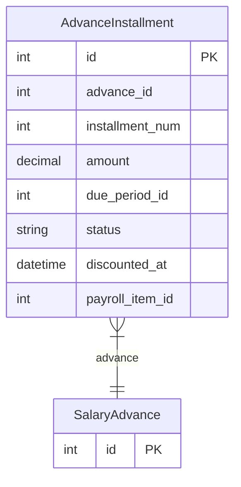

# AdvanceInstallment

> Table name: `advance_installments`

**Schema location:** Lines 11906-11921

## Fields

| Field | Type | Required | Unique | Default | Notes |
|-------|------|----------|--------|---------|-------|
| `id` | `Int` | ✅ | 🔑 PK | `autoincrement(` |  |
| `advance_id` | `Int` | ✅ |  | `` |  |
| `installment_num` | `Int` | ✅ |  | `` |  |
| `amount` | `Decimal` | ✅ |  | `` | DB: Decimal(12, 2) |
| `due_period_id` | `Int?` | ❌ |  | `` |  |
| `status` | `String` | ✅ |  | `"PENDING"` | DB: VarChar(20). PENDING, DISCOUNTED |
| `discounted_at` | `DateTime?` | ❌ |  | `` |  |
| `payroll_item_id` | `Int?` | ❌ |  | `` |  |

## Relations

| Field | Type | Cardinality | FK Fields | References | On Delete |
|-------|------|-------------|-----------|------------|-----------|
| `advance` | [SalaryAdvance](./models/SalaryAdvance.md) | Many-to-One | advance_id | id | Cascade |

## Referenced By

| Model | Field | Cardinality |
|-------|-------|-------------|
| [SalaryAdvance](./models/SalaryAdvance.md) | `installments` | Has many |

## Indexes

- `advance_id`
- `due_period_id, status`

## Entity Diagram

