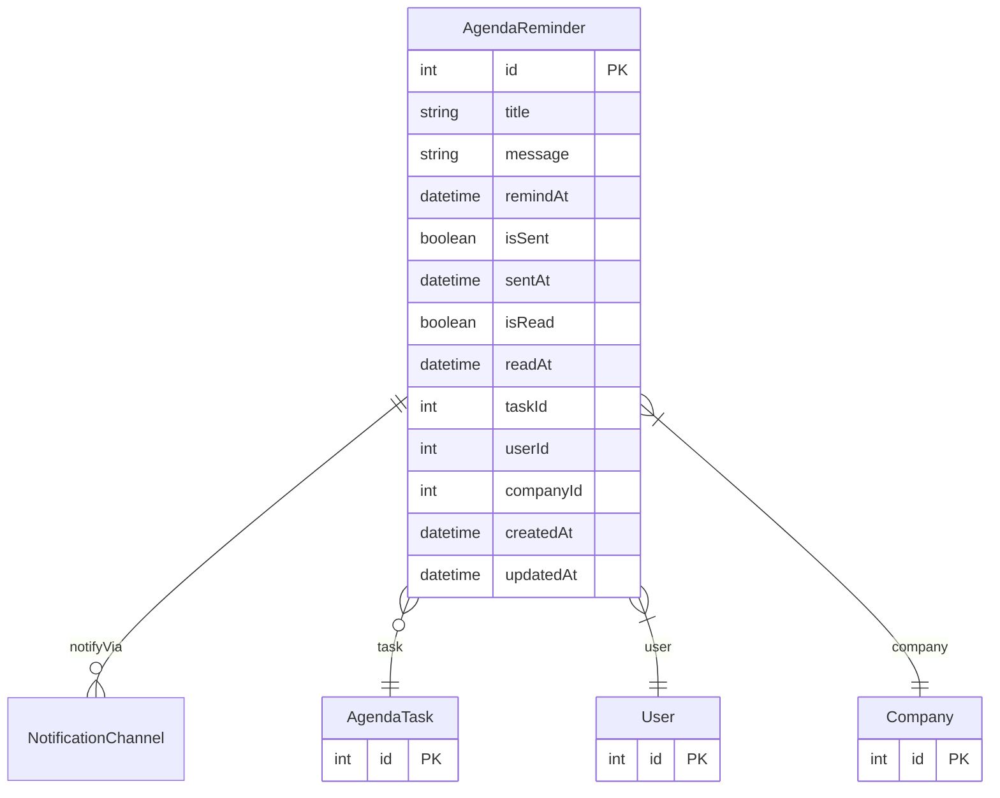

# AgendaReminder

> Table name: `agenda_reminders`

**Schema location:** Lines 14430-14462

## Fields

| Field | Type | Required | Unique | Default | Notes |
|-------|------|----------|--------|---------|-------|
| `id` | `Int` | ✅ | 🔑 PK | `autoincrement(` |  |
| `title` | `String` | ✅ |  | `` | DB: VarChar(200) |
| `message` | `String?` | ❌ |  | `` |  |
| `remindAt` | `DateTime` | ✅ |  | `` |  |
| `isSent` | `Boolean` | ✅ |  | `false` | Estado |
| `sentAt` | `DateTime?` | ❌ |  | `` |  |
| `isRead` | `Boolean` | ✅ |  | `false` |  |
| `readAt` | `DateTime?` | ❌ |  | `` |  |
| `taskId` | `Int?` | ❌ |  | `` | Relación con tarea (opcional - puede ser recordatorio standalone) |
| `userId` | `Int` | ✅ |  | `` | Usuario dueño del recordatorio |
| `companyId` | `Int` | ✅ |  | `` | Multi-tenant |
| `createdAt` | `DateTime` | ✅ |  | `now(` | Timestamps |
| `updatedAt` | `DateTime` | ✅ |  | `` |  |

## Relations

| Field | Type | Cardinality | FK Fields | References | On Delete |
|-------|------|-------------|-----------|------------|-----------|
| `notifyVia` | [NotificationChannel](./models/NotificationChannel.md) | One-to-Many | - | - | - |
| `task` | [AgendaTask](./models/AgendaTask.md) | Many-to-One (optional) | taskId | id | Cascade |
| `user` | [User](./models/User.md) | Many-to-One | userId | id | Cascade |
| `company` | [Company](./models/Company.md) | Many-to-One | companyId | id | Cascade |

## Referenced By

| Model | Field | Cardinality |
|-------|-------|-------------|
| [Company](./models/Company.md) | `agendaReminders` | Has many |
| [User](./models/User.md) | `agendaReminders` | Has many |
| [AgendaTask](./models/AgendaTask.md) | `reminders` | Has many |

## Indexes

- `userId, remindAt, isSent`
- `companyId`

## Entity Diagram

