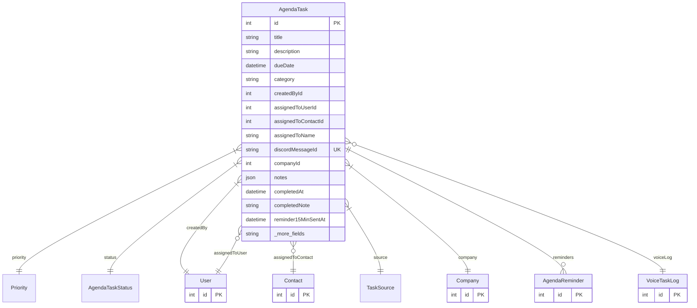

# AgendaTask

> Table name: `agenda_tasks`

**Schema location:** Lines 14374-14428

## Fields

| Field | Type | Required | Unique | Default | Notes |
|-------|------|----------|--------|---------|-------|
| `id` | `Int` | ✅ | 🔑 PK | `autoincrement(` |  |
| `title` | `String` | ✅ |  | `` | DB: VarChar(200) |
| `description` | `String?` | ❌ |  | `` |  |
| `dueDate` | `DateTime?` | ❌ |  | `` |  |
| `category` | `String?` | ❌ |  | `` | DB: VarChar(100) |
| `createdById` | `Int` | ✅ |  | `` | Quien creó (siempre el usuario que pide) |
| `assignedToUserId` | `Int?` | ❌ |  | `` | A quien se le pide (usuario del sistema O contacto externo) |
| `assignedToContactId` | `Int?` | ❌ |  | `` |  |
| `assignedToName` | `String?` | ❌ |  | `` | DB: VarChar(200). Nombre para display rápido |
| `discordMessageId` | `String?` | ❌ | ✅ | `` |  |
| `companyId` | `Int` | ✅ |  | `` | Multi-tenant |
| `notes` | `Json?` | ❌ |  | `` | Notas adicionales (JSON array) |
| `completedAt` | `DateTime?` | ❌ |  | `` | Completado |
| `completedNote` | `String?` | ❌ |  | `` |  |
| `reminder15MinSentAt` | `DateTime?` | ❌ |  | `` | Notificación de recordatorio (15 min antes) |
| `createdAt` | `DateTime` | ✅ |  | `now(` | Timestamps |
| `updatedAt` | `DateTime` | ✅ |  | `` |  |

## Relations

| Field | Type | Cardinality | FK Fields | References | On Delete |
|-------|------|-------------|-----------|------------|-----------|
| `priority` | [Priority](./models/Priority.md) | Many-to-One | - | - | - |
| `status` | [AgendaTaskStatus](./models/AgendaTaskStatus.md) | Many-to-One | - | - | - |
| `createdBy` | [User](./models/User.md) | Many-to-One | createdById | id | Cascade |
| `assignedToUser` | [User](./models/User.md) | Many-to-One (optional) | assignedToUserId | id | - |
| `assignedToContact` | [Contact](./models/Contact.md) | Many-to-One (optional) | assignedToContactId | id | - |
| `source` | [TaskSource](./models/TaskSource.md) | Many-to-One | - | - | - |
| `company` | [Company](./models/Company.md) | Many-to-One | companyId | id | Cascade |
| `reminders` | [AgendaReminder](./models/AgendaReminder.md) | One-to-Many | - | - | - |
| `voiceLog` | [VoiceTaskLog](./models/VoiceTaskLog.md) | Many-to-One (optional) | - | - | - |

## Referenced By

| Model | Field | Cardinality |
|-------|-------|-------------|
| [Company](./models/Company.md) | `agendaTasks` | Has many |
| [User](./models/User.md) | `agendaTasksCreated` | Has many |
| [User](./models/User.md) | `agendaTasksAssigned` | Has many |
| [Contact](./models/Contact.md) | `agendaTasks` | Has many |
| [AgendaReminder](./models/AgendaReminder.md) | `task` | Has one |
| [VoiceTaskLog](./models/VoiceTaskLog.md) | `task` | Has one |

## Indexes

- `createdById, status`
- `assignedToUserId`
- `assignedToContactId`
- `companyId, dueDate`
- `companyId, status`

## Entity Diagram

