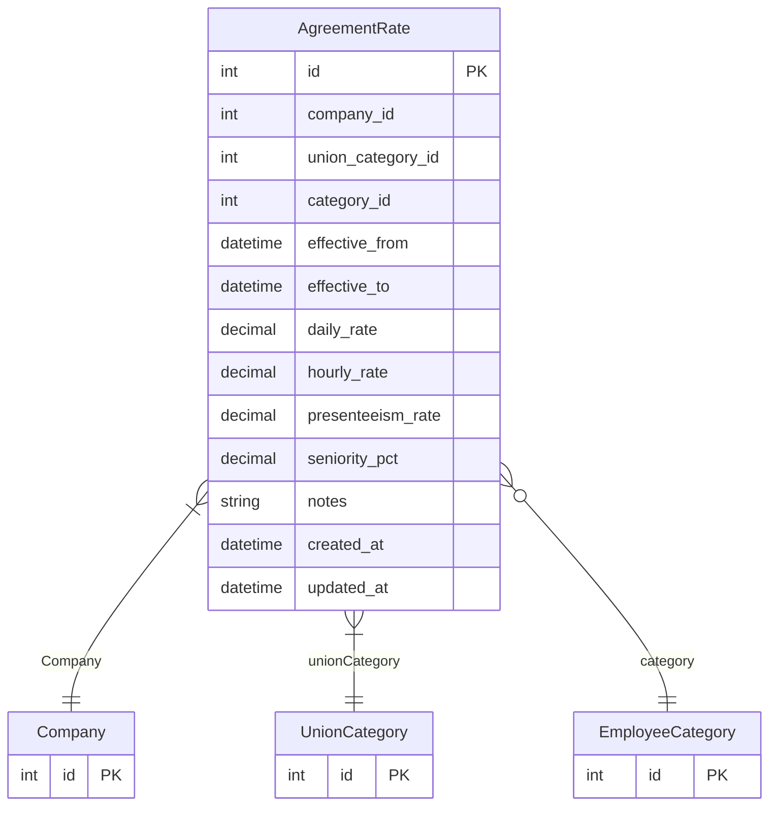

# AgreementRate

> Table name: `agreement_rates`

**Schema location:** Lines 12093-12119

## Fields

| Field | Type | Required | Unique | Default | Notes |
|-------|------|----------|--------|---------|-------|
| `id` | `Int` | ✅ | 🔑 PK | `autoincrement(` |  |
| `company_id` | `Int` | ✅ |  | `` |  |
| `union_category_id` | `Int` | ✅ |  | `` | Nueva FK a UnionCategory |
| `category_id` | `Int?` | ❌ |  | `` | Legacy FK a EmployeeCategory (deprecated) |
| `effective_from` | `DateTime` | ✅ |  | `` | DB: Date |
| `effective_to` | `DateTime?` | ❌ |  | `` | DB: Date |
| `daily_rate` | `Decimal` | ✅ |  | `` | DB: Decimal(12, 2). Valor día básico |
| `hourly_rate` | `Decimal?` | ❌ |  | `` | DB: Decimal(12, 2). Valor hora |
| `presenteeism_rate` | `Decimal?` | ❌ |  | `` | DB: Decimal(12, 2). Valor presentismo/día |
| `seniority_pct` | `Decimal?` | ❌ |  | `` | DB: Decimal(5, 2). % antigüedad por año |
| `notes` | `String?` | ❌ |  | `` |  |
| `created_at` | `DateTime` | ✅ |  | `now(` |  |
| `updated_at` | `DateTime` | ✅ |  | `` |  |

## Relations

| Field | Type | Cardinality | FK Fields | References | On Delete |
|-------|------|-------------|-----------|------------|-----------|
| `Company` | [Company](./models/Company.md) | Many-to-One | company_id | id | Cascade |
| `unionCategory` | [UnionCategory](./models/UnionCategory.md) | Many-to-One | union_category_id | id | Cascade |
| `category` | [EmployeeCategory](./models/EmployeeCategory.md) | Many-to-One (optional) | category_id | id | SetNull |

## Referenced By

| Model | Field | Cardinality |
|-------|-------|-------------|
| [Company](./models/Company.md) | `agreementRates` | Has many |
| [EmployeeCategory](./models/EmployeeCategory.md) | `agreementRates` | Has many |
| [UnionCategory](./models/UnionCategory.md) | `agreementRates` | Has many |

## Indexes

- `union_category_id, effective_from`
- `category_id, effective_from`
- `company_id`

## Entity Diagram

