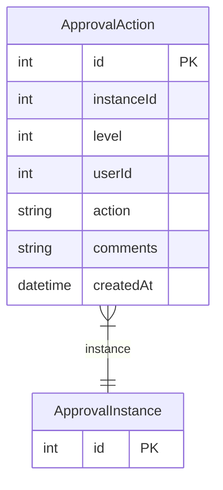

# ApprovalAction

> Table name: `approval_actions`

**Schema location:** Lines 14999-15012

## Fields

| Field | Type | Required | Unique | Default | Notes |
|-------|------|----------|--------|---------|-------|
| `id` | `Int` | ✅ | 🔑 PK | `autoincrement(` |  |
| `instanceId` | `Int` | ✅ |  | `` |  |
| `level` | `Int` | ✅ |  | `` |  |
| `userId` | `Int` | ✅ |  | `` |  |
| `action` | `String` | ✅ |  | `` |  |
| `comments` | `String?` | ❌ |  | `` |  |
| `createdAt` | `DateTime` | ✅ |  | `now(` |  |

## Relations

| Field | Type | Cardinality | FK Fields | References | On Delete |
|-------|------|-------------|-----------|------------|-----------|
| `instance` | [ApprovalInstance](./models/ApprovalInstance.md) | Many-to-One | instanceId | id | Cascade |

## Referenced By

| Model | Field | Cardinality |
|-------|-------|-------------|
| [ApprovalInstance](./models/ApprovalInstance.md) | `actions` | Has many |

## Indexes

- `instanceId`

## Entity Diagram

