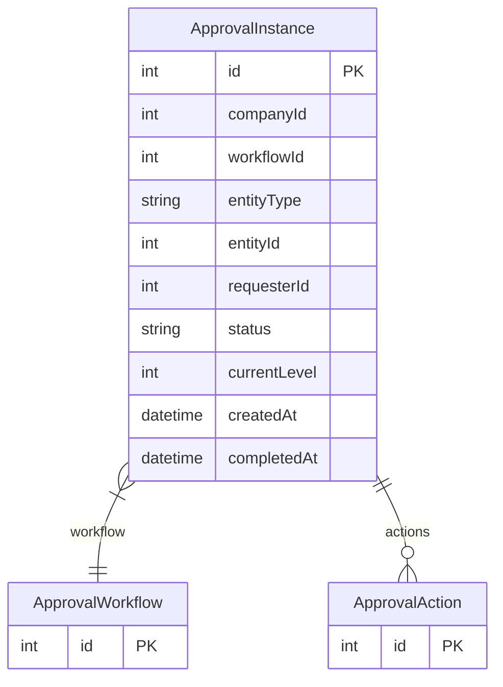

# ApprovalInstance

> Table name: `approval_instances`

**Schema location:** Lines 14979-14997

## Fields

| Field | Type | Required | Unique | Default | Notes |
|-------|------|----------|--------|---------|-------|
| `id` | `Int` | ✅ | 🔑 PK | `autoincrement(` |  |
| `companyId` | `Int` | ✅ |  | `` |  |
| `workflowId` | `Int` | ✅ |  | `` |  |
| `entityType` | `String` | ✅ |  | `` |  |
| `entityId` | `Int` | ✅ |  | `` |  |
| `requesterId` | `Int` | ✅ |  | `` |  |
| `status` | `String` | ✅ |  | `"PENDING"` |  |
| `currentLevel` | `Int` | ✅ |  | `1` |  |
| `createdAt` | `DateTime` | ✅ |  | `now(` |  |
| `completedAt` | `DateTime?` | ❌ |  | `` |  |

## Relations

| Field | Type | Cardinality | FK Fields | References | On Delete |
|-------|------|-------------|-----------|------------|-----------|
| `workflow` | [ApprovalWorkflow](./models/ApprovalWorkflow.md) | Many-to-One | workflowId | id | - |
| `actions` | [ApprovalAction](./models/ApprovalAction.md) | One-to-Many | - | - | - |

## Referenced By

| Model | Field | Cardinality |
|-------|-------|-------------|
| [ApprovalWorkflow](./models/ApprovalWorkflow.md) | `instances` | Has many |
| [ApprovalAction](./models/ApprovalAction.md) | `instance` | Has one |

## Indexes

- `companyId, status`
- `entityType, entityId`

## Entity Diagram

