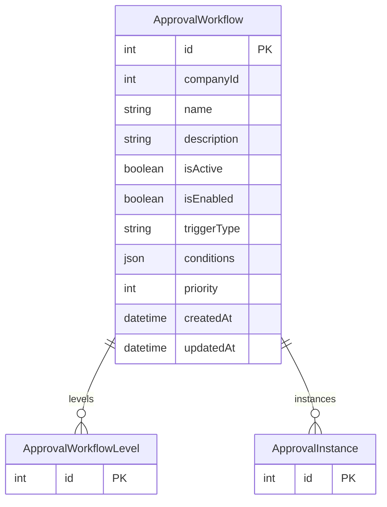

# ApprovalWorkflow

> Table name: `approval_workflows`

**Schema location:** Lines 14944-14962

## Fields

| Field | Type | Required | Unique | Default | Notes |
|-------|------|----------|--------|---------|-------|
| `id` | `Int` | ✅ | 🔑 PK | `autoincrement(` |  |
| `companyId` | `Int` | ✅ |  | `` |  |
| `name` | `String` | ✅ |  | `` |  |
| `description` | `String?` | ❌ |  | `` |  |
| `isActive` | `Boolean` | ✅ |  | `true` |  |
| `isEnabled` | `Boolean` | ✅ |  | `false` |  |
| `triggerType` | `String` | ✅ |  | `` |  |
| `conditions` | `Json` | ✅ |  | `"[]"` |  |
| `priority` | `Int` | ✅ |  | `0` |  |
| `createdAt` | `DateTime` | ✅ |  | `now(` |  |
| `updatedAt` | `DateTime` | ✅ |  | `` |  |

## Relations

| Field | Type | Cardinality | FK Fields | References | On Delete |
|-------|------|-------------|-----------|------------|-----------|
| `levels` | [ApprovalWorkflowLevel](./models/ApprovalWorkflowLevel.md) | One-to-Many | - | - | - |
| `instances` | [ApprovalInstance](./models/ApprovalInstance.md) | One-to-Many | - | - | - |

## Referenced By

| Model | Field | Cardinality |
|-------|-------|-------------|
| [ApprovalWorkflowLevel](./models/ApprovalWorkflowLevel.md) | `workflow` | Has one |
| [ApprovalInstance](./models/ApprovalInstance.md) | `workflow` | Has one |

## Indexes

- `companyId, isActive`

## Entity Diagram

