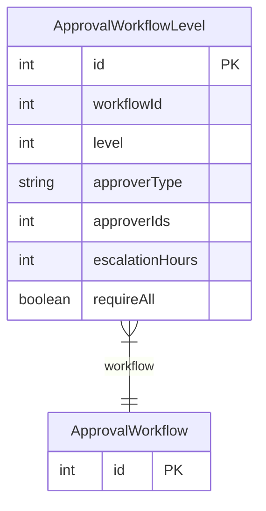

# ApprovalWorkflowLevel

> Table name: `approval_workflow_levels`

**Schema location:** Lines 14964-14977

## Fields

| Field | Type | Required | Unique | Default | Notes |
|-------|------|----------|--------|---------|-------|
| `id` | `Int` | ✅ | 🔑 PK | `autoincrement(` |  |
| `workflowId` | `Int` | ✅ |  | `` |  |
| `level` | `Int` | ✅ |  | `` |  |
| `approverType` | `String` | ✅ |  | `` |  |
| `approverIds` | `Int[]` | ✅ |  | `` |  |
| `escalationHours` | `Int?` | ❌ |  | `` |  |
| `requireAll` | `Boolean` | ✅ |  | `false` |  |

## Relations

| Field | Type | Cardinality | FK Fields | References | On Delete |
|-------|------|-------------|-----------|------------|-----------|
| `workflow` | [ApprovalWorkflow](./models/ApprovalWorkflow.md) | Many-to-One | workflowId | id | Cascade |

## Referenced By

| Model | Field | Cardinality |
|-------|-------|-------------|
| [ApprovalWorkflow](./models/ApprovalWorkflow.md) | `levels` | Has many |

## Indexes

- `workflowId`

## Entity Diagram

