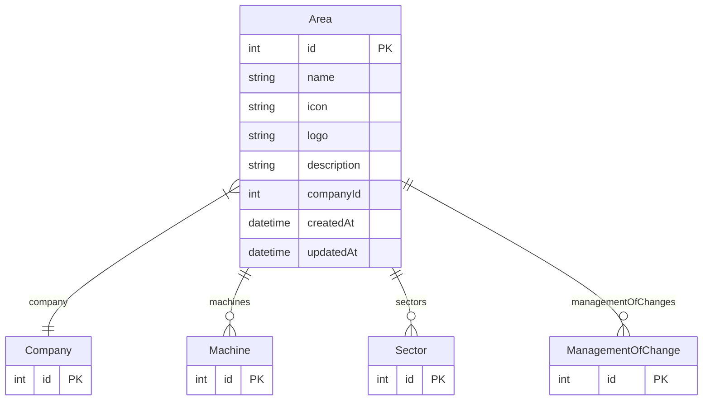

# Area

> Table name: `Area`

**Schema location:** Lines 753-768

## Fields

| Field | Type | Required | Unique | Default | Notes |
|-------|------|----------|--------|---------|-------|
| `id` | `Int` | ✅ | 🔑 PK | `autoincrement(` |  |
| `name` | `String` | ✅ |  | `` |  |
| `icon` | `String?` | ❌ |  | `` |  |
| `logo` | `String?` | ❌ |  | `` |  |
| `description` | `String?` | ❌ |  | `` |  |
| `companyId` | `Int` | ✅ |  | `` |  |
| `createdAt` | `DateTime` | ✅ |  | `now(` |  |
| `updatedAt` | `DateTime` | ✅ |  | `` |  |

## Relations

| Field | Type | Cardinality | FK Fields | References | On Delete |
|-------|------|-------------|-----------|------------|-----------|
| `company` | [Company](./models/Company.md) | Many-to-One | companyId | id | Cascade |
| `machines` | [Machine](./models/Machine.md) | One-to-Many | - | - | - |
| `sectors` | [Sector](./models/Sector.md) | One-to-Many | - | - | - |
| `managementOfChanges` | [ManagementOfChange](./models/ManagementOfChange.md) | One-to-Many | - | - | - |

## Referenced By

| Model | Field | Cardinality |
|-------|-------|-------------|
| [Company](./models/Company.md) | `areas` | Has many |
| [Sector](./models/Sector.md) | `area` | Has one |
| [Machine](./models/Machine.md) | `area` | Has one |
| [ManagementOfChange](./models/ManagementOfChange.md) | `area` | Has one |

## Entity Diagram

