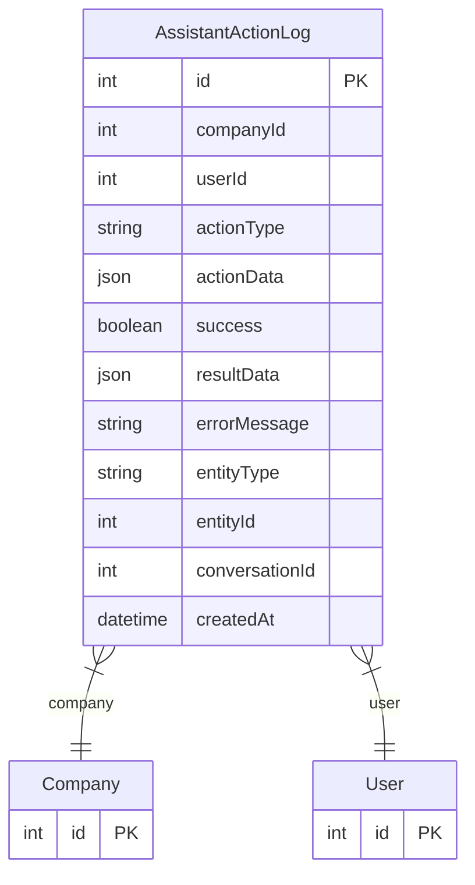

# AssistantActionLog

> Table name: `assistant_action_logs`

**Schema location:** Lines 6072-6102

## Fields

| Field | Type | Required | Unique | Default | Notes |
|-------|------|----------|--------|---------|-------|
| `id` | `Int` | ✅ | 🔑 PK | `autoincrement(` |  |
| `companyId` | `Int` | ✅ |  | `` |  |
| `userId` | `Int` | ✅ |  | `` |  |
| `actionType` | `String` | ✅ |  | `` | DB: VarChar(50). Qué acción se ejecutó |
| `actionData` | `Json` | ✅ |  | `` |  |
| `success` | `Boolean` | ✅ |  | `` | Resultado |
| `resultData` | `Json?` | ❌ |  | `` |  |
| `errorMessage` | `String?` | ❌ |  | `` | DB: Text |
| `entityType` | `String?` | ❌ |  | `` | DB: VarChar(50). Entidad afectada |
| `entityId` | `Int?` | ❌ |  | `` |  |
| `conversationId` | `Int?` | ❌ |  | `` | Conversación donde se ejecutó (opcional) |
| `createdAt` | `DateTime` | ✅ |  | `now(` |  |

## Relations

| Field | Type | Cardinality | FK Fields | References | On Delete |
|-------|------|-------------|-----------|------------|-----------|
| `company` | [Company](./models/Company.md) | Many-to-One | companyId | id | Cascade |
| `user` | [User](./models/User.md) | Many-to-One | userId | id | Cascade |

## Referenced By

| Model | Field | Cardinality |
|-------|-------|-------------|
| [Company](./models/Company.md) | `assistantActionLogs` | Has many |
| [User](./models/User.md) | `assistantActionLogs` | Has many |

## Indexes

- `companyId`
- `userId`
- `actionType`
- `createdAt`

## Entity Diagram

