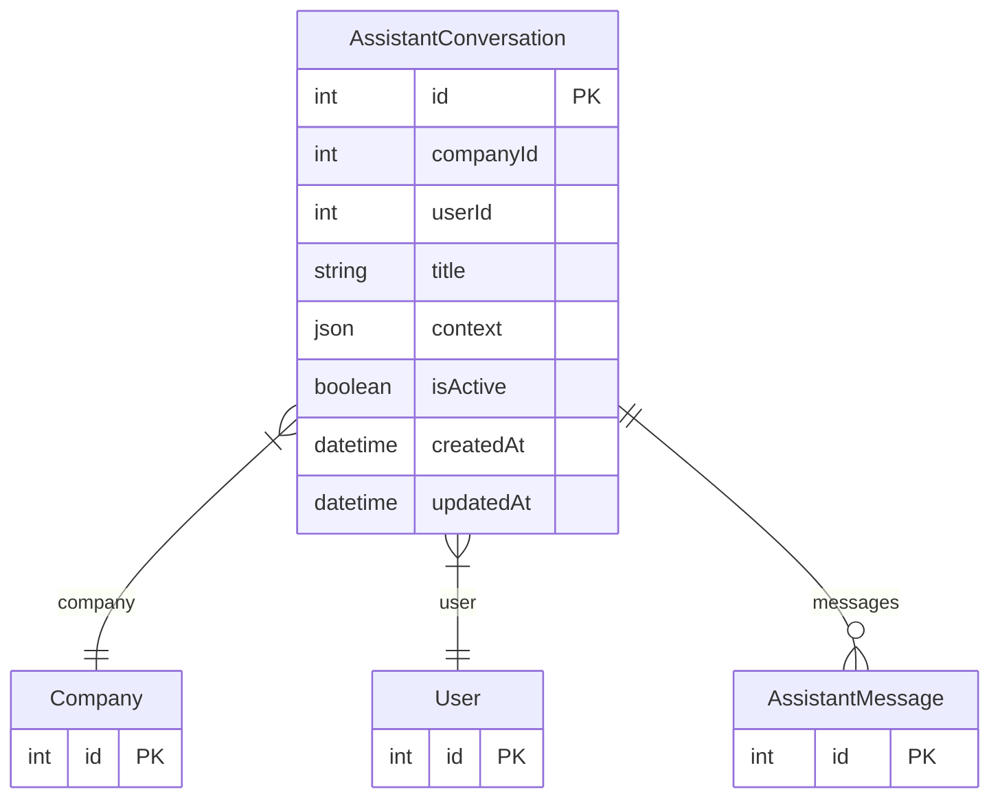

# AssistantConversation

> Table name: `assistant_conversations`

**Schema location:** Lines 6013-6038

## Fields

| Field | Type | Required | Unique | Default | Notes |
|-------|------|----------|--------|---------|-------|
| `id` | `Int` | ✅ | 🔑 PK | `autoincrement(` |  |
| `companyId` | `Int` | ✅ |  | `` |  |
| `userId` | `Int` | ✅ |  | `` |  |
| `title` | `String?` | ❌ |  | `` | DB: VarChar(255). Título de la conversación (opcional, auto-generado) |
| `context` | `Json?` | ❌ |  | `` | Contexto de la conversación (página actual, entidad, etc.) |
| `isActive` | `Boolean` | ✅ |  | `true` | Estado |
| `createdAt` | `DateTime` | ✅ |  | `now(` |  |
| `updatedAt` | `DateTime` | ✅ |  | `` |  |

## Relations

| Field | Type | Cardinality | FK Fields | References | On Delete |
|-------|------|-------------|-----------|------------|-----------|
| `company` | [Company](./models/Company.md) | Many-to-One | companyId | id | Cascade |
| `user` | [User](./models/User.md) | Many-to-One | userId | id | Cascade |
| `messages` | [AssistantMessage](./models/AssistantMessage.md) | One-to-Many | - | - | - |

## Referenced By

| Model | Field | Cardinality |
|-------|-------|-------------|
| [Company](./models/Company.md) | `assistantConversations` | Has many |
| [User](./models/User.md) | `assistantConversations` | Has many |
| [AssistantMessage](./models/AssistantMessage.md) | `conversation` | Has one |

## Indexes

- `companyId`
- `userId`

## Entity Diagram

