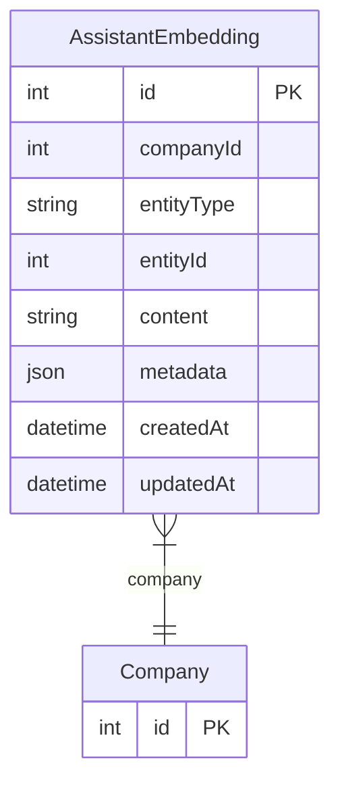

# AssistantEmbedding

> Table name: `assistant_embeddings`

**Schema location:** Lines 5988-6010

## Fields

| Field | Type | Required | Unique | Default | Notes |
|-------|------|----------|--------|---------|-------|
| `id` | `Int` | ✅ | 🔑 PK | `autoincrement(` |  |
| `companyId` | `Int` | ✅ |  | `` |  |
| `entityType` | `String` | ✅ |  | `` | DB: VarChar(50). 'work_order', 'failure', 'solution', etc. |
| `entityId` | `Int` | ✅ |  | `` |  |
| `content` | `String` | ✅ |  | `` | DB: Text. Texto indexado |
| `metadata` | `Json?` | ❌ |  | `` | Metadata para filtros (JSON con machineId, sectorId, etc.) |
| `createdAt` | `DateTime` | ✅ |  | `now(` |  |
| `updatedAt` | `DateTime` | ✅ |  | `` |  |

## Relations

| Field | Type | Cardinality | FK Fields | References | On Delete |
|-------|------|-------------|-----------|------------|-----------|
| `company` | [Company](./models/Company.md) | Many-to-One | companyId | id | Cascade |

## Referenced By

| Model | Field | Cardinality |
|-------|-------|-------------|
| [Company](./models/Company.md) | `assistantEmbeddings` | Has many |

## Indexes

- `companyId`
- `entityType`

## Unique Constraints

- `entityType, entityId`

## Entity Diagram

