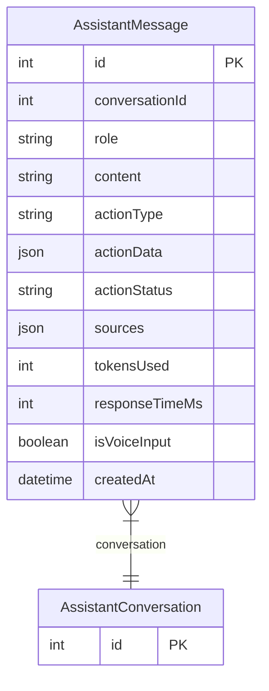

# AssistantMessage

> Table name: `assistant_messages`

**Schema location:** Lines 6041-6069

## Fields

| Field | Type | Required | Unique | Default | Notes |
|-------|------|----------|--------|---------|-------|
| `id` | `Int` | ✅ | 🔑 PK | `autoincrement(` |  |
| `conversationId` | `Int` | ✅ |  | `` |  |
| `role` | `String` | ✅ |  | `` | DB: VarChar(20). 'user' | 'assistant' |
| `content` | `String` | ✅ |  | `` | DB: Text |
| `actionType` | `String?` | ❌ |  | `` | DB: VarChar(50). Si fue una acción |
| `actionData` | `Json?` | ❌ |  | `` |  |
| `actionStatus` | `String?` | ❌ |  | `` | DB: VarChar(20). 'pending', 'confirmed', 'executed', 'cancelled' |
| `sources` | `Json?` | ❌ |  | `` | Fuentes/referencias usadas en la respuesta |
| `tokensUsed` | `Int?` | ❌ |  | `` | Métricas |
| `responseTimeMs` | `Int?` | ❌ |  | `` |  |
| `isVoiceInput` | `Boolean` | ✅ |  | `false` | Si fue por voz |
| `createdAt` | `DateTime` | ✅ |  | `now(` |  |

## Relations

| Field | Type | Cardinality | FK Fields | References | On Delete |
|-------|------|-------------|-----------|------------|-----------|
| `conversation` | [AssistantConversation](./models/AssistantConversation.md) | Many-to-One | conversationId | id | Cascade |

## Referenced By

| Model | Field | Cardinality |
|-------|-------|-------------|
| [AssistantConversation](./models/AssistantConversation.md) | `messages` | Has many |

## Indexes

- `conversationId`

## Entity Diagram

