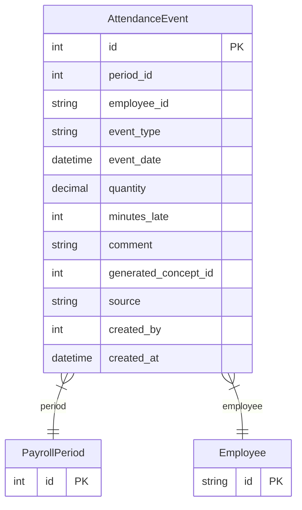

# AttendanceEvent

> Table name: `attendance_events`

**Schema location:** Lines 12217-12244

## Fields

| Field | Type | Required | Unique | Default | Notes |
|-------|------|----------|--------|---------|-------|
| `id` | `Int` | ✅ | 🔑 PK | `autoincrement(` |  |
| `period_id` | `Int` | ✅ |  | `` |  |
| `employee_id` | `String` | ✅ |  | `` | DB: VarChar(255) |
| `event_type` | `String` | ✅ |  | `` | DB: VarChar(30) |
| `event_date` | `DateTime` | ✅ |  | `` | DB: Date |
| `quantity` | `Decimal` | ✅ |  | `` | DB: Decimal(5, 2). Días u horas |
| `minutes_late` | `Int?` | ❌ |  | `` | Para llegadas tarde |
| `comment` | `String?` | ❌ |  | `` |  |
| `generated_concept_id` | `Int?` | ❌ |  | `` | Si genera concepto variable automáticamente |
| `source` | `String` | ✅ |  | `"MANUAL"` | DB: VarChar(30) |
| `created_by` | `Int?` | ❌ |  | `` |  |
| `created_at` | `DateTime` | ✅ |  | `now(` |  |

## Relations

| Field | Type | Cardinality | FK Fields | References | On Delete |
|-------|------|-------------|-----------|------------|-----------|
| `period` | [PayrollPeriod](./models/PayrollPeriod.md) | Many-to-One | period_id | id | Cascade |
| `employee` | [Employee](./models/Employee.md) | Many-to-One | employee_id | id | Cascade |

## Referenced By

| Model | Field | Cardinality |
|-------|-------|-------------|
| [Employee](./models/Employee.md) | `attendanceEvents` | Has many |
| [PayrollPeriod](./models/PayrollPeriod.md) | `attendanceEvents` | Has many |

## Indexes

- `period_id, employee_id`
- `event_type`

## Entity Diagram

