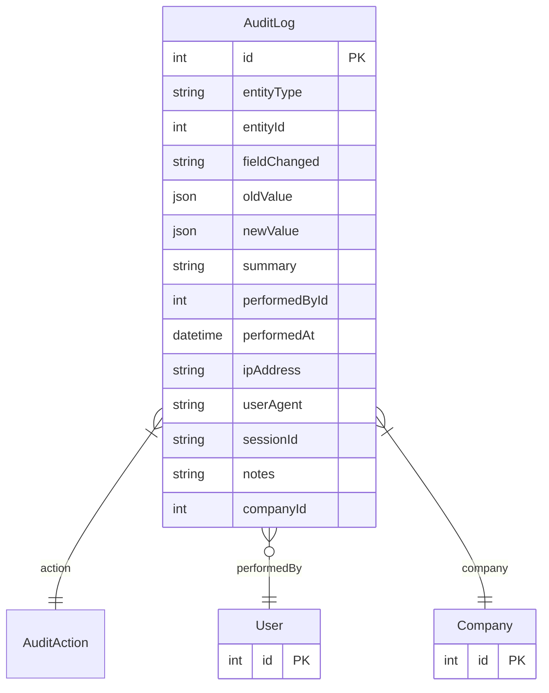

# AuditLog

> Table name: `audit_logs`

**Schema location:** Lines 12761-12798

## Fields

| Field | Type | Required | Unique | Default | Notes |
|-------|------|----------|--------|---------|-------|
| `id` | `Int` | ✅ | 🔑 PK | `autoincrement(` |  |
| `entityType` | `String` | ✅ |  | `` | WorkOrder, FailureOccurrence, PTW, Machine, etc. |
| `entityId` | `Int` | ✅ |  | `` | ID de la entidad |
| `fieldChanged` | `String?` | ❌ |  | `` | Campo específico que cambió |
| `oldValue` | `Json?` | ❌ |  | `` | Valor anterior |
| `newValue` | `Json?` | ❌ |  | `` | Valor nuevo |
| `summary` | `String?` | ❌ |  | `` | Resumen legible del cambio |
| `performedById` | `Int?` | ❌ |  | `` | Quién y cuándo |
| `performedAt` | `DateTime` | ✅ |  | `now(` |  |
| `ipAddress` | `String?` | ❌ |  | `` | Contexto adicional |
| `userAgent` | `String?` | ❌ |  | `` |  |
| `sessionId` | `String?` | ❌ |  | `` |  |
| `notes` | `String?` | ❌ |  | `` |  |
| `companyId` | `Int` | ✅ |  | `` | Multi-tenancy |

## Relations

| Field | Type | Cardinality | FK Fields | References | On Delete |
|-------|------|-------------|-----------|------------|-----------|
| `action` | [AuditAction](./models/AuditAction.md) | Many-to-One | - | - | - |
| `performedBy` | [User](./models/User.md) | Many-to-One (optional) | performedById | id | - |
| `company` | [Company](./models/Company.md) | Many-to-One | companyId | id | Cascade |

## Referenced By

| Model | Field | Cardinality |
|-------|-------|-------------|
| [Company](./models/Company.md) | `auditLogs` | Has many |
| [User](./models/User.md) | `auditLogs` | Has many |

## Indexes

- `entityType, entityId`
- `performedById`
- `performedAt`
- `companyId, entityType`
- `companyId, performedAt`

## Entity Diagram

