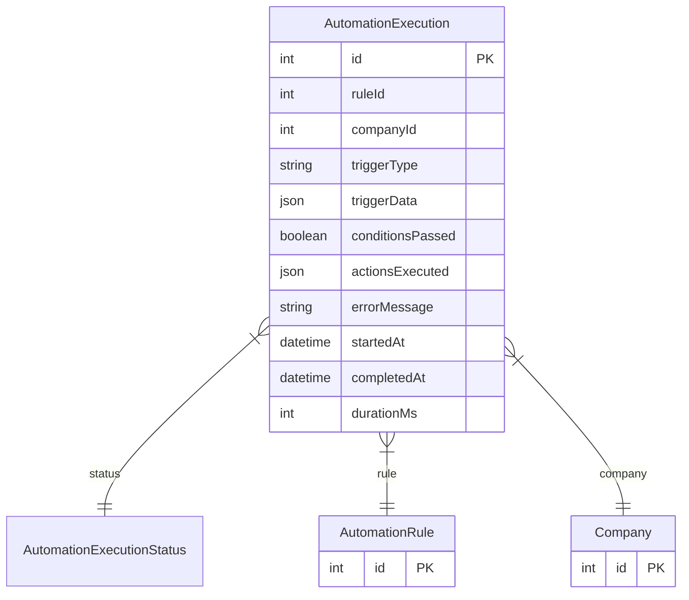

# AutomationExecution

> Table name: `automation_executions`

**Schema location:** Lines 12537-12565

## Fields

| Field | Type | Required | Unique | Default | Notes |
|-------|------|----------|--------|---------|-------|
| `id` | `Int` | ✅ | 🔑 PK | `autoincrement(` |  |
| `ruleId` | `Int` | ✅ |  | `` |  |
| `companyId` | `Int` | ✅ |  | `` |  |
| `triggerType` | `String` | ✅ |  | `` | Tipo de trigger que activó la regla |
| `triggerData` | `Json` | ✅ |  | `` | Datos del evento que disparó la ejecución |
| `conditionsPassed` | `Boolean` | ✅ |  | `false` |  |
| `actionsExecuted` | `Json?` | ❌ |  | `` | Resultado de cada acción ejecutada |
| `errorMessage` | `String?` | ❌ |  | `` | Mensaje de error si falló |
| `startedAt` | `DateTime` | ✅ |  | `now(` | Tiempos |
| `completedAt` | `DateTime?` | ❌ |  | `` |  |
| `durationMs` | `Int?` | ❌ |  | `` | Duración en milisegundos |

## Relations

| Field | Type | Cardinality | FK Fields | References | On Delete |
|-------|------|-------------|-----------|------------|-----------|
| `status` | [AutomationExecutionStatus](./models/AutomationExecutionStatus.md) | Many-to-One | - | - | - |
| `rule` | [AutomationRule](./models/AutomationRule.md) | Many-to-One | ruleId | id | Cascade |
| `company` | [Company](./models/Company.md) | Many-to-One | companyId | id | Cascade |

## Referenced By

| Model | Field | Cardinality |
|-------|-------|-------------|
| [Company](./models/Company.md) | `automationExecutions` | Has many |
| [AutomationRule](./models/AutomationRule.md) | `executions` | Has many |

## Indexes

- `ruleId`
- `companyId, startedAt`
- `companyId, status`

## Entity Diagram

