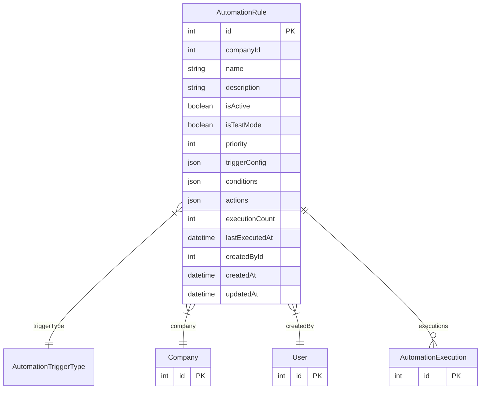

# AutomationRule

> Table name: `automation_rules`

**Schema location:** Lines 12492-12534

## Fields

| Field | Type | Required | Unique | Default | Notes |
|-------|------|----------|--------|---------|-------|
| `id` | `Int` | ✅ | 🔑 PK | `autoincrement(` |  |
| `companyId` | `Int` | ✅ |  | `` |  |
| `name` | `String` | ✅ |  | `` | Nombre descriptivo |
| `description` | `String?` | ❌ |  | `` | Descripción detallada |
| `isActive` | `Boolean` | ✅ |  | `true` |  |
| `isTestMode` | `Boolean` | ✅ |  | `false` | Solo simula, no ejecuta |
| `priority` | `Int` | ✅ |  | `100` | Menor = mayor prioridad |
| `triggerConfig` | `Json?` | ❌ |  | `` | Configuración específica del trigger |
| `conditions` | `Json` | ✅ |  | `"[]"` | Condiciones (todas deben cumplirse) |
| `actions` | `Json` | ✅ |  | `"[]"` | Acciones a ejecutar |
| `executionCount` | `Int` | ✅ |  | `0` | Estadísticas |
| `lastExecutedAt` | `DateTime?` | ❌ |  | `` |  |
| `createdById` | `Int` | ✅ |  | `` | Auditoría |
| `createdAt` | `DateTime` | ✅ |  | `now(` |  |
| `updatedAt` | `DateTime` | ✅ |  | `` |  |

## Relations

| Field | Type | Cardinality | FK Fields | References | On Delete |
|-------|------|-------------|-----------|------------|-----------|
| `triggerType` | [AutomationTriggerType](./models/AutomationTriggerType.md) | Many-to-One | - | - | - |
| `company` | [Company](./models/Company.md) | Many-to-One | companyId | id | Cascade |
| `createdBy` | [User](./models/User.md) | Many-to-One | createdById | id | - |
| `executions` | [AutomationExecution](./models/AutomationExecution.md) | One-to-Many | - | - | - |

## Referenced By

| Model | Field | Cardinality |
|-------|-------|-------------|
| [Company](./models/Company.md) | `automationRules` | Has many |
| [User](./models/User.md) | `automationRulesCreated` | Has many |
| [AutomationExecution](./models/AutomationExecution.md) | `rule` | Has one |

## Indexes

- `companyId, isActive`
- `companyId, triggerType`

## Entity Diagram

