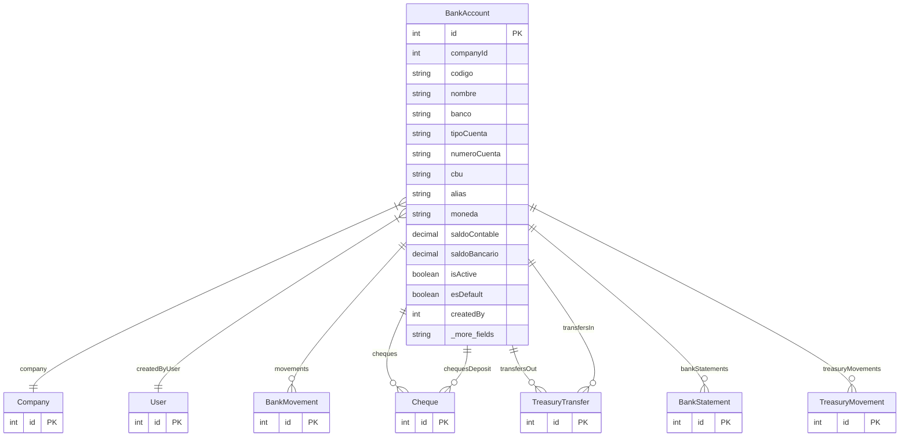

# BankAccount

> Table name: `bank_accounts`

**Schema location:** Lines 10730-10770

## Fields

| Field | Type | Required | Unique | Default | Notes |
|-------|------|----------|--------|---------|-------|
| `id` | `Int` | ✅ | 🔑 PK | `autoincrement(` |  |
| `companyId` | `Int` | ✅ |  | `` |  |
| `codigo` | `String` | ✅ |  | `` | DB: VarChar(20) |
| `nombre` | `String` | ✅ |  | `` | DB: VarChar(100) |
| `banco` | `String` | ✅ |  | `` | DB: VarChar(100) |
| `tipoCuenta` | `String` | ✅ |  | `` | DB: VarChar(50). CC, CA |
| `numeroCuenta` | `String` | ✅ |  | `` | DB: VarChar(50) |
| `cbu` | `String?` | ❌ |  | `` | DB: VarChar(22) |
| `alias` | `String?` | ❌ |  | `` | DB: VarChar(50) |
| `moneda` | `String` | ✅ |  | `"ARS"` | DB: VarChar(3) |
| `saldoContable` | `Decimal` | ✅ |  | `0` | DB: Decimal(15, 2). Según sistema |
| `saldoBancario` | `Decimal` | ✅ |  | `0` | DB: Decimal(15, 2). Según extracto |
| `isActive` | `Boolean` | ✅ |  | `true` | Config |
| `esDefault` | `Boolean` | ✅ |  | `false` |  |
| `createdBy` | `Int` | ✅ |  | `` | Auditoría |
| `createdAt` | `DateTime` | ✅ |  | `now(` |  |
| `updatedAt` | `DateTime` | ✅ |  | `` |  |

## Relations

| Field | Type | Cardinality | FK Fields | References | On Delete |
|-------|------|-------------|-----------|------------|-----------|
| `company` | [Company](./models/Company.md) | Many-to-One | companyId | id | Cascade |
| `createdByUser` | [User](./models/User.md) | Many-to-One | createdBy | id | - |
| `movements` | [BankMovement](./models/BankMovement.md) | One-to-Many | - | - | - |
| `cheques` | [Cheque](./models/Cheque.md) | One-to-Many | - | - | - |
| `chequesDeposit` | [Cheque](./models/Cheque.md) | One-to-Many | - | - | - |
| `transfersOut` | [TreasuryTransfer](./models/TreasuryTransfer.md) | One-to-Many | - | - | - |
| `transfersIn` | [TreasuryTransfer](./models/TreasuryTransfer.md) | One-to-Many | - | - | - |
| `bankStatements` | [BankStatement](./models/BankStatement.md) | One-to-Many | - | - | - |
| `treasuryMovements` | [TreasuryMovement](./models/TreasuryMovement.md) | One-to-Many | - | - | - |

## Referenced By

| Model | Field | Cardinality |
|-------|-------|-------------|
| [Company](./models/Company.md) | `bankAccounts` | Has many |
| [User](./models/User.md) | `bankAccountsCreated` | Has many |
| [BankMovement](./models/BankMovement.md) | `bankAccount` | Has one |
| [Cheque](./models/Cheque.md) | `bankAccount` | Has one |
| [Cheque](./models/Cheque.md) | `depositoBankAccount` | Has one |
| [TreasuryTransfer](./models/TreasuryTransfer.md) | `origenBanco` | Has one |
| [TreasuryTransfer](./models/TreasuryTransfer.md) | `destinoBanco` | Has one |
| [BankStatement](./models/BankStatement.md) | `bankAccount` | Has one |
| [TreasuryMovement](./models/TreasuryMovement.md) | `bankAccount` | Has one |

## Indexes

- `companyId`
- `isActive`

## Unique Constraints

- `companyId, codigo`

## Entity Diagram

