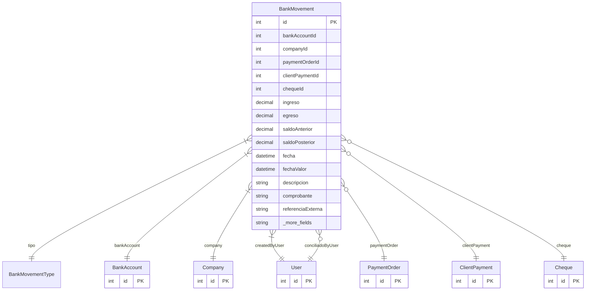

# BankMovement

> Table name: `bank_movements`

**Schema location:** Lines 10773-10823

## Fields

| Field | Type | Required | Unique | Default | Notes |
|-------|------|----------|--------|---------|-------|
| `id` | `Int` | ✅ | 🔑 PK | `autoincrement(` |  |
| `bankAccountId` | `Int` | ✅ |  | `` |  |
| `companyId` | `Int` | ✅ |  | `` |  |
| `paymentOrderId` | `Int?` | ❌ |  | `` | Transferencia a proveedor |
| `clientPaymentId` | `Int?` | ❌ |  | `` | Transferencia de cliente |
| `chequeId` | `Int?` | ❌ |  | `` | Depósito/débito de cheque |
| `ingreso` | `Decimal` | ✅ |  | `0` | DB: Decimal(15, 2). Montos |
| `egreso` | `Decimal` | ✅ |  | `0` | DB: Decimal(15, 2) |
| `saldoAnterior` | `Decimal` | ✅ |  | `` | DB: Decimal(15, 2) |
| `saldoPosterior` | `Decimal` | ✅ |  | `` | DB: Decimal(15, 2) |
| `fecha` | `DateTime` | ✅ |  | `` | DB: Date. Info |
| `fechaValor` | `DateTime?` | ❌ |  | `` | DB: Date. Fecha efectiva banco |
| `descripcion` | `String?` | ❌ |  | `` |  |
| `comprobante` | `String?` | ❌ |  | `` | DB: VarChar(100) |
| `referenciaExterna` | `String?` | ❌ |  | `` | DB: VarChar(100). Ref del extracto |
| `conciliado` | `Boolean` | ✅ |  | `false` | Conciliación |
| `conciliadoAt` | `DateTime?` | ❌ |  | `` |  |
| `conciliadoBy` | `Int?` | ❌ |  | `` |  |
| `createdBy` | `Int` | ✅ |  | `` | Auditoría |
| `createdAt` | `DateTime` | ✅ |  | `now(` |  |

## Relations

| Field | Type | Cardinality | FK Fields | References | On Delete |
|-------|------|-------------|-----------|------------|-----------|
| `tipo` | [BankMovementType](./models/BankMovementType.md) | Many-to-One | - | - | - |
| `bankAccount` | [BankAccount](./models/BankAccount.md) | Many-to-One | bankAccountId | id | Cascade |
| `company` | [Company](./models/Company.md) | Many-to-One | companyId | id | Cascade |
| `createdByUser` | [User](./models/User.md) | Many-to-One | createdBy | id | - |
| `paymentOrder` | [PaymentOrder](./models/PaymentOrder.md) | Many-to-One (optional) | paymentOrderId | id | - |
| `clientPayment` | [ClientPayment](./models/ClientPayment.md) | Many-to-One (optional) | clientPaymentId | id | - |
| `cheque` | [Cheque](./models/Cheque.md) | Many-to-One (optional) | chequeId | id | - |
| `conciliadoByUser` | [User](./models/User.md) | Many-to-One (optional) | conciliadoBy | id | - |

## Referenced By

| Model | Field | Cardinality |
|-------|-------|-------------|
| [Company](./models/Company.md) | `bankMovements` | Has many |
| [User](./models/User.md) | `bankMovementsCreated` | Has many |
| [User](./models/User.md) | `bankMovementsConciliados` | Has many |
| [PaymentOrder](./models/PaymentOrder.md) | `bankMovements` | Has many |
| [ClientPayment](./models/ClientPayment.md) | `bankMovements` | Has many |
| [BankAccount](./models/BankAccount.md) | `movements` | Has many |
| [Cheque](./models/Cheque.md) | `bankMovements` | Has many |

## Indexes

- `bankAccountId`
- `companyId`
- `fecha`
- `conciliado`

## Entity Diagram

