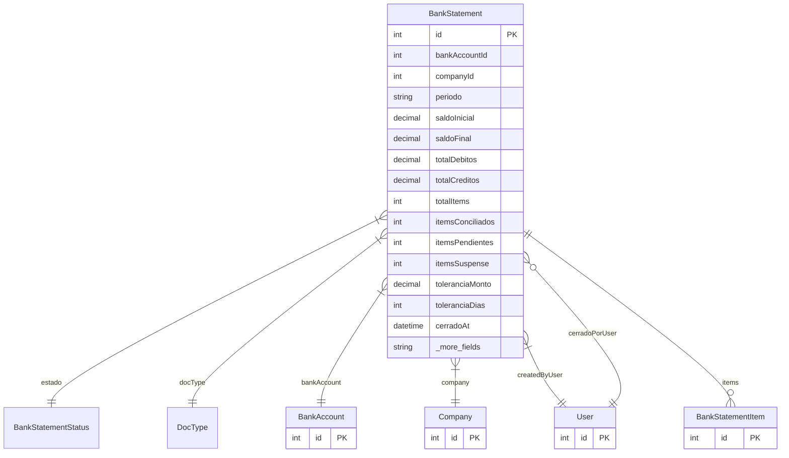

# BankStatement

> Table name: `bank_statements`

**Schema location:** Lines 10996-11048

## Fields

| Field | Type | Required | Unique | Default | Notes |
|-------|------|----------|--------|---------|-------|
| `id` | `Int` | ✅ | 🔑 PK | `autoincrement(` |  |
| `bankAccountId` | `Int` | ✅ |  | `` |  |
| `companyId` | `Int` | ✅ |  | `` |  |
| `periodo` | `String` | ✅ |  | `` | DB: VarChar(7). "YYYY-MM" |
| `saldoInicial` | `Decimal` | ✅ |  | `` | DB: Decimal(15, 2). Saldos |
| `saldoFinal` | `Decimal` | ✅ |  | `0` | DB: Decimal(15, 2) |
| `totalDebitos` | `Decimal` | ✅ |  | `0` | DB: Decimal(15, 2) |
| `totalCreditos` | `Decimal` | ✅ |  | `0` | DB: Decimal(15, 2) |
| `totalItems` | `Int` | ✅ |  | `0` | Estadísticas |
| `itemsConciliados` | `Int` | ✅ |  | `0` |  |
| `itemsPendientes` | `Int` | ✅ |  | `0` |  |
| `itemsSuspense` | `Int` | ✅ |  | `0` |  |
| `toleranciaMonto` | `Decimal` | ✅ |  | `0.01` | DB: Decimal(15, 2). Tolerancias de matching |
| `toleranciaDias` | `Int` | ✅ |  | `3` |  |
| `cerradoAt` | `DateTime?` | ❌ |  | `` | Cierre |
| `cerradoPor` | `Int?` | ❌ |  | `` |  |
| `notasCierre` | `String?` | ❌ |  | `` |  |
| `diferenciasJustificadas` | `Json?` | ❌ |  | `` | Justificación de diferencias (JSON: [{monto, concepto, justificacion}]) |
| `createdBy` | `Int` | ✅ |  | `` | Auditoría |
| `createdAt` | `DateTime` | ✅ |  | `now(` |  |
| `updatedAt` | `DateTime` | ✅ |  | `` |  |

## Relations

| Field | Type | Cardinality | FK Fields | References | On Delete |
|-------|------|-------------|-----------|------------|-----------|
| `estado` | [BankStatementStatus](./models/BankStatementStatus.md) | Many-to-One | - | - | - |
| `docType` | [DocType](./models/DocType.md) | Many-to-One | - | - | - |
| `bankAccount` | [BankAccount](./models/BankAccount.md) | Many-to-One | bankAccountId | id | Cascade |
| `company` | [Company](./models/Company.md) | Many-to-One | companyId | id | Cascade |
| `createdByUser` | [User](./models/User.md) | Many-to-One | createdBy | id | - |
| `cerradoPorUser` | [User](./models/User.md) | Many-to-One (optional) | cerradoPor | id | - |
| `items` | [BankStatementItem](./models/BankStatementItem.md) | One-to-Many | - | - | - |

## Referenced By

| Model | Field | Cardinality |
|-------|-------|-------------|
| [Company](./models/Company.md) | `bankStatements` | Has many |
| [User](./models/User.md) | `bankStatementsCreated` | Has many |
| [User](./models/User.md) | `bankStatementsCerrados` | Has many |
| [BankAccount](./models/BankAccount.md) | `bankStatements` | Has many |
| [BankStatementItem](./models/BankStatementItem.md) | `statement` | Has one |

## Indexes

- `companyId`
- `estado`
- `periodo`
- `docType`

## Unique Constraints

- `bankAccountId, periodo`

## Entity Diagram

