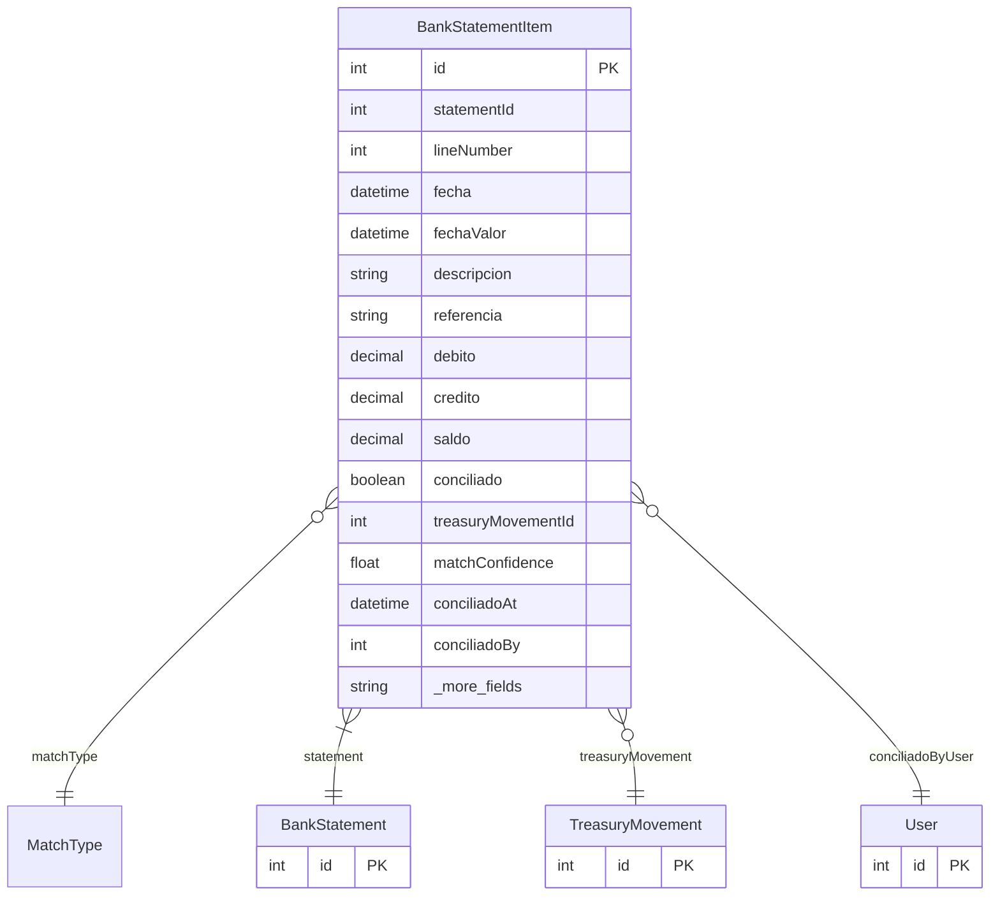

# BankStatementItem

> Table name: `bank_statement_items`

**Schema location:** Lines 11051-11090

## Fields

| Field | Type | Required | Unique | Default | Notes |
|-------|------|----------|--------|---------|-------|
| `id` | `Int` | ✅ | 🔑 PK | `autoincrement(` |  |
| `statementId` | `Int` | ✅ |  | `` |  |
| `lineNumber` | `Int` | ✅ |  | `` |  |
| `fecha` | `DateTime` | ✅ |  | `` | DB: Date. Datos del extracto |
| `fechaValor` | `DateTime?` | ❌ |  | `` | DB: Date |
| `descripcion` | `String` | ✅ |  | `` |  |
| `referencia` | `String?` | ❌ |  | `` | DB: VarChar(100) |
| `debito` | `Decimal` | ✅ |  | `0` | DB: Decimal(15, 2). Montos |
| `credito` | `Decimal` | ✅ |  | `0` | DB: Decimal(15, 2) |
| `saldo` | `Decimal` | ✅ |  | `` | DB: Decimal(15, 2) |
| `conciliado` | `Boolean` | ✅ |  | `false` | Conciliación |
| `treasuryMovementId` | `Int?` | ❌ |  | `` |  |
| `matchConfidence` | `Float?` | ❌ |  | `` |  |
| `conciliadoAt` | `DateTime?` | ❌ |  | `` |  |
| `conciliadoBy` | `Int?` | ❌ |  | `` |  |
| `esSuspense` | `Boolean` | ✅ |  | `false` | Suspense |
| `suspenseResuelto` | `Boolean` | ✅ |  | `false` |  |
| `suspenseNotas` | `String?` | ❌ |  | `` |  |

## Relations

| Field | Type | Cardinality | FK Fields | References | On Delete |
|-------|------|-------------|-----------|------------|-----------|
| `matchType` | [MatchType](./models/MatchType.md) | Many-to-One (optional) | - | - | - |
| `statement` | [BankStatement](./models/BankStatement.md) | Many-to-One | statementId | id | Cascade |
| `treasuryMovement` | [TreasuryMovement](./models/TreasuryMovement.md) | Many-to-One (optional) | treasuryMovementId | id | - |
| `conciliadoByUser` | [User](./models/User.md) | Many-to-One (optional) | conciliadoBy | id | - |

## Referenced By

| Model | Field | Cardinality |
|-------|-------|-------------|
| [User](./models/User.md) | `bankStatementItemsConciliados` | Has many |
| [BankStatement](./models/BankStatement.md) | `items` | Has many |
| [TreasuryMovement](./models/TreasuryMovement.md) | `statementItems` | Has many |

## Indexes

- `statementId`
- `conciliado`
- `treasuryMovementId`
- `fecha`

## Entity Diagram

