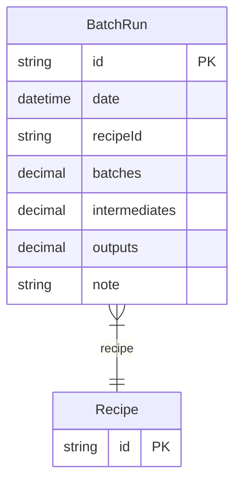

# BatchRun

> Table name: `BatchRun`

**Schema location:** Lines 2866-2877

## Fields

| Field | Type | Required | Unique | Default | Notes |
|-------|------|----------|--------|---------|-------|
| `id` | `String` | ✅ | 🔑 PK | `uuid(` |  |
| `date` | `DateTime` | ✅ |  | `` |  |
| `recipeId` | `String` | ✅ |  | `` |  |
| `batches` | `Decimal` | ✅ |  | `` | DB: Decimal(12, 4) |
| `intermediates` | `Decimal?` | ❌ |  | `` | DB: Decimal(12, 4) |
| `outputs` | `Decimal?` | ❌ |  | `` | DB: Decimal(12, 4) |
| `note` | `String?` | ❌ |  | `` |  |

## Relations

| Field | Type | Cardinality | FK Fields | References | On Delete |
|-------|------|-------------|-----------|------------|-----------|
| `recipe` | [Recipe](./models/Recipe.md) | Many-to-One | recipeId | id | Cascade |

## Referenced By

| Model | Field | Cardinality |
|-------|-------|-------------|
| [Recipe](./models/Recipe.md) | `batchRuns` | Has many |

## Entity Diagram

