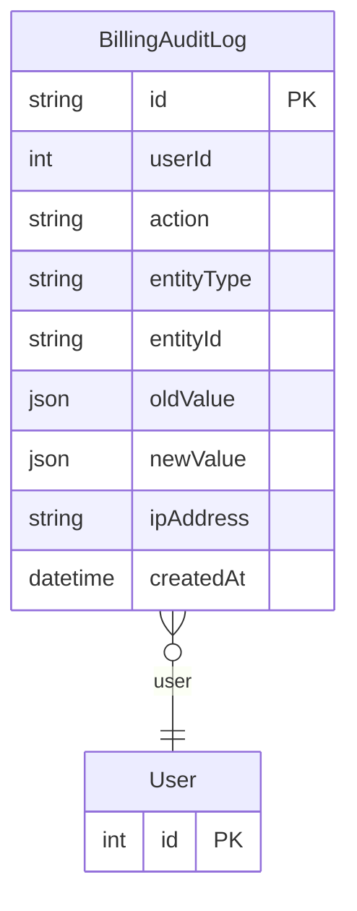

# BillingAuditLog

> Table name: `billing_audit_log`

**Schema location:** Lines 11491-11508

## Fields

| Field | Type | Required | Unique | Default | Notes |
|-------|------|----------|--------|---------|-------|
| `id` | `String` | ✅ | 🔑 PK | `` |  |
| `userId` | `Int?` | ❌ |  | `` |  |
| `action` | `String` | ✅ |  | `` | 'PLAN_CHANGE', 'TOKENS_ADDED', 'INVOICE_PAID', etc. |
| `entityType` | `String` | ✅ |  | `` | 'subscription', 'invoice', 'payment' |
| `entityId` | `String` | ✅ |  | `` |  |
| `oldValue` | `Json?` | ❌ |  | `` |  |
| `newValue` | `Json?` | ❌ |  | `` |  |
| `ipAddress` | `String?` | ❌ |  | `` |  |
| `createdAt` | `DateTime` | ✅ |  | `now(` |  |

## Relations

| Field | Type | Cardinality | FK Fields | References | On Delete |
|-------|------|-------------|-----------|------------|-----------|
| `user` | [User](./models/User.md) | Many-to-One (optional) | userId | id | - |

## Referenced By

| Model | Field | Cardinality |
|-------|-------|-------------|
| [User](./models/User.md) | `billingAuditLogs` | Has many |

## Indexes

- `entityType, entityId`
- `createdAt`

## Entity Diagram

