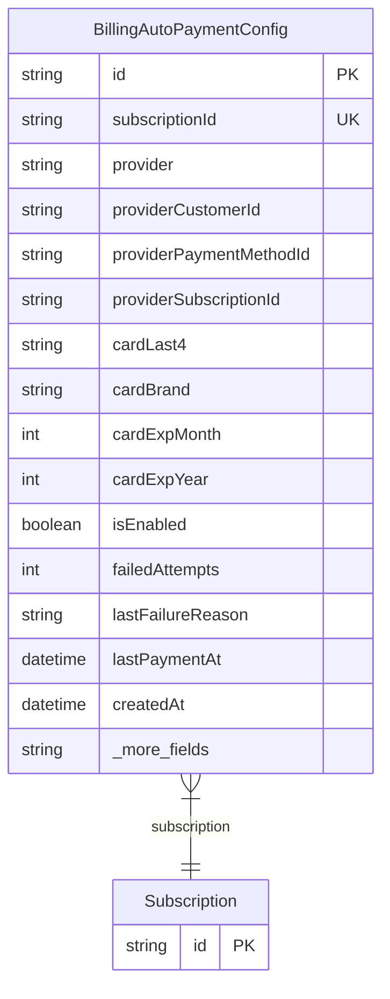

# BillingAutoPaymentConfig

> Table name: `billing_auto_payment_configs`

**Schema location:** Lines 11587-11620

## Fields

| Field | Type | Required | Unique | Default | Notes |
|-------|------|----------|--------|---------|-------|
| `id` | `String` | ✅ | 🔑 PK | `` |  |
| `subscriptionId` | `String` | ✅ | ✅ | `` |  |
| `provider` | `String` | ✅ |  | `` | 'STRIPE', 'MERCADOPAGO' |
| `providerCustomerId` | `String?` | ❌ |  | `` | Datos del proveedor |
| `providerPaymentMethodId` | `String?` | ❌ |  | `` |  |
| `providerSubscriptionId` | `String?` | ❌ |  | `` |  |
| `cardLast4` | `String?` | ❌ |  | `` | Datos de la tarjeta (para mostrar) |
| `cardBrand` | `String?` | ❌ |  | `` | visa, mastercard, amex |
| `cardExpMonth` | `Int?` | ❌ |  | `` |  |
| `cardExpYear` | `Int?` | ❌ |  | `` |  |
| `isEnabled` | `Boolean` | ✅ |  | `true` | Estado |
| `failedAttempts` | `Int` | ✅ |  | `0` |  |
| `lastFailureReason` | `String?` | ❌ |  | `` |  |
| `lastPaymentAt` | `DateTime?` | ❌ |  | `` |  |
| `createdAt` | `DateTime` | ✅ |  | `now(` |  |
| `updatedAt` | `DateTime` | ✅ |  | `` |  |

## Relations

| Field | Type | Cardinality | FK Fields | References | On Delete |
|-------|------|-------------|-----------|------------|-----------|
| `subscription` | [Subscription](./models/Subscription.md) | Many-to-One | subscriptionId | id | Cascade |

## Referenced By

| Model | Field | Cardinality |
|-------|-------|-------------|
| [Subscription](./models/Subscription.md) | `autoPaymentConfig` | Has one |

## Indexes

- `subscriptionId`
- `provider`

## Entity Diagram

