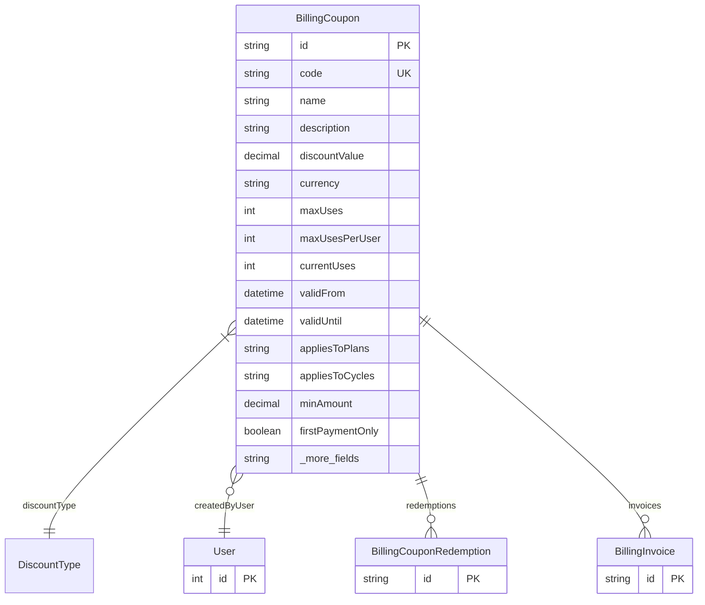

# BillingCoupon

> Table name: `billing_coupons`

**Schema location:** Lines 11511-11557

## Fields

| Field | Type | Required | Unique | Default | Notes |
|-------|------|----------|--------|---------|-------|
| `id` | `String` | ✅ | 🔑 PK | `` |  |
| `code` | `String` | ✅ | ✅ | `` |  |
| `name` | `String` | ✅ |  | `` |  |
| `description` | `String?` | ❌ |  | `` |  |
| `discountValue` | `Decimal` | ✅ |  | `` | DB: Decimal(12, 2) |
| `currency` | `String` | ✅ |  | `"ARS"` |  |
| `maxUses` | `Int?` | ❌ |  | `` | NULL = ilimitado |
| `maxUsesPerUser` | `Int` | ✅ |  | `1` |  |
| `currentUses` | `Int` | ✅ |  | `0` |  |
| `validFrom` | `DateTime` | ✅ |  | `now(` | Validez |
| `validUntil` | `DateTime?` | ❌ |  | `` |  |
| `appliesToPlans` | `String[]` | ✅ |  | `[]` | Aplicabilidad |
| `appliesToCycles` | `String[]` | ✅ |  | `[]` |  |
| `minAmount` | `Decimal?` | ❌ |  | `` | DB: Decimal(12, 2) |
| `firstPaymentOnly` | `Boolean` | ✅ |  | `false` |  |
| `durationMonths` | `Int?` | ❌ |  | `` | NULL = aplica solo una vez |
| `isActive` | `Boolean` | ✅ |  | `true` | Estado |
| `createdBy` | `Int?` | ❌ |  | `` | Metadata |
| `createdAt` | `DateTime` | ✅ |  | `now(` |  |
| `updatedAt` | `DateTime` | ✅ |  | `` |  |

## Relations

| Field | Type | Cardinality | FK Fields | References | On Delete |
|-------|------|-------------|-----------|------------|-----------|
| `discountType` | [DiscountType](./models/DiscountType.md) | Many-to-One | - | - | - |
| `createdByUser` | [User](./models/User.md) | Many-to-One (optional) | createdBy | id | - |
| `redemptions` | [BillingCouponRedemption](./models/BillingCouponRedemption.md) | One-to-Many | - | - | - |
| `invoices` | [BillingInvoice](./models/BillingInvoice.md) | One-to-Many | - | - | - |

## Referenced By

| Model | Field | Cardinality |
|-------|-------|-------------|
| [User](./models/User.md) | `couponsCreated` | Has many |
| [BillingInvoice](./models/BillingInvoice.md) | `coupon` | Has one |
| [BillingCouponRedemption](./models/BillingCouponRedemption.md) | `coupon` | Has one |

## Indexes

- `code`
- `isActive`
- `validFrom, validUntil`

## Entity Diagram

