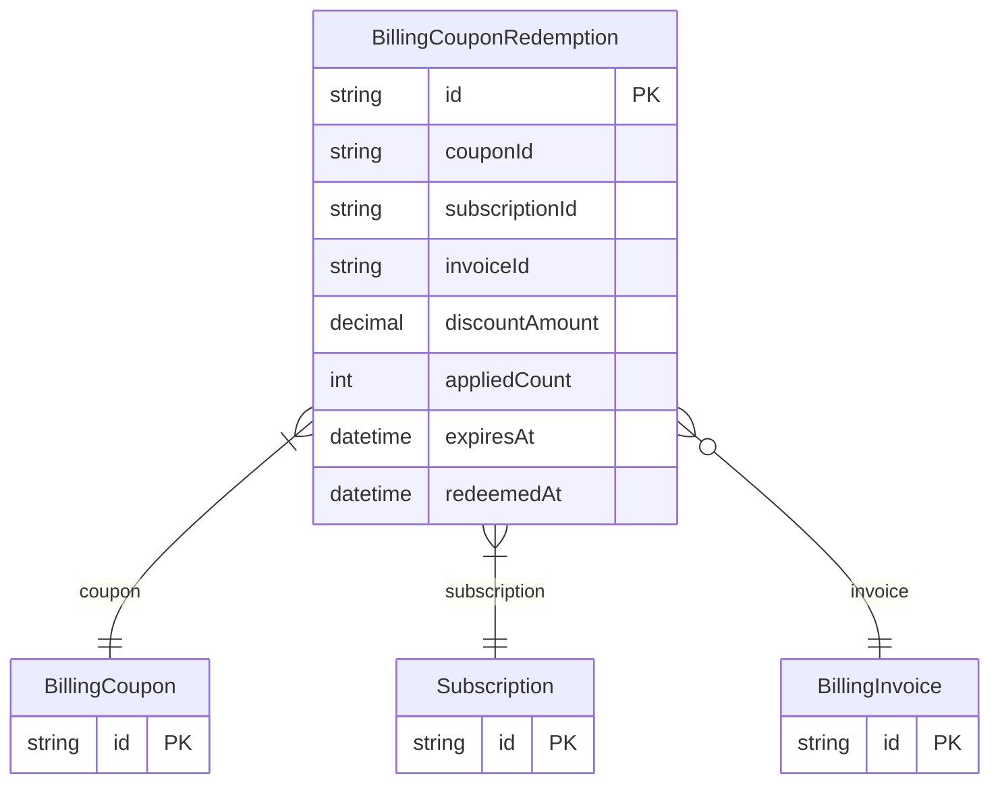

# BillingCouponRedemption

> Table name: `billing_coupon_redemptions`

**Schema location:** Lines 11560-11584

## Fields

| Field | Type | Required | Unique | Default | Notes |
|-------|------|----------|--------|---------|-------|
| `id` | `String` | ✅ | 🔑 PK | `` |  |
| `couponId` | `String` | ✅ |  | `` |  |
| `subscriptionId` | `String` | ✅ |  | `` |  |
| `invoiceId` | `String?` | ❌ |  | `` |  |
| `discountAmount` | `Decimal` | ✅ |  | `` | DB: Decimal(12, 2). Descuento aplicado |
| `appliedCount` | `Int` | ✅ |  | `1` | Control de duración |
| `expiresAt` | `DateTime?` | ❌ |  | `` |  |
| `redeemedAt` | `DateTime` | ✅ |  | `now(` |  |

## Relations

| Field | Type | Cardinality | FK Fields | References | On Delete |
|-------|------|-------------|-----------|------------|-----------|
| `coupon` | [BillingCoupon](./models/BillingCoupon.md) | Many-to-One | couponId | id | Cascade |
| `subscription` | [Subscription](./models/Subscription.md) | Many-to-One | subscriptionId | id | Cascade |
| `invoice` | [BillingInvoice](./models/BillingInvoice.md) | Many-to-One (optional) | invoiceId | id | - |

## Referenced By

| Model | Field | Cardinality |
|-------|-------|-------------|
| [Subscription](./models/Subscription.md) | `couponRedemptions` | Has many |
| [BillingInvoice](./models/BillingInvoice.md) | `couponRedemptions` | Has many |
| [BillingCoupon](./models/BillingCoupon.md) | `redemptions` | Has many |

## Indexes

- `subscriptionId`
- `couponId`

## Unique Constraints

- `couponId, subscriptionId`

## Entity Diagram

