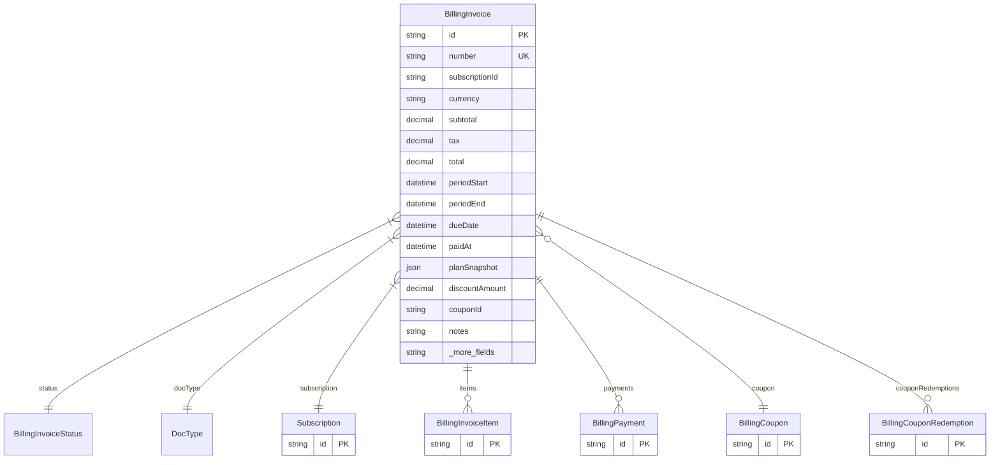

# BillingInvoice

> Table name: `invoices`

**Schema location:** Lines 11347-11395

## Fields

| Field | Type | Required | Unique | Default | Notes |
|-------|------|----------|--------|---------|-------|
| `id` | `String` | ✅ | 🔑 PK | `` |  |
| `number` | `String` | ✅ | ✅ | `` |  |
| `subscriptionId` | `String` | ✅ |  | `` |  |
| `currency` | `String` | ✅ |  | `"ARS"` | Montos con moneda |
| `subtotal` | `Decimal` | ✅ |  | `` | DB: Decimal(12, 2) |
| `tax` | `Decimal` | ✅ |  | `0` | DB: Decimal(12, 2) |
| `total` | `Decimal` | ✅ |  | `` | DB: Decimal(12, 2) |
| `periodStart` | `DateTime` | ✅ |  | `` | Período facturado |
| `periodEnd` | `DateTime` | ✅ |  | `` |  |
| `dueDate` | `DateTime` | ✅ |  | `` |  |
| `paidAt` | `DateTime?` | ❌ |  | `` |  |
| `planSnapshot` | `Json` | ✅ |  | `` | {planId, displayName, monthlyPrice, billingCycle} |
| `discountAmount` | `Decimal?` | ❌ |  | `0` | DB: Decimal(12, 2). Descuentos/Cupones |
| `couponId` | `String?` | ❌ |  | `` |  |
| `notes` | `String?` | ❌ |  | `` |  |
| `createdAt` | `DateTime` | ✅ |  | `now(` | Timestamps |
| `updatedAt` | `DateTime` | ✅ |  | `` |  |

## Relations

| Field | Type | Cardinality | FK Fields | References | On Delete |
|-------|------|-------------|-----------|------------|-----------|
| `status` | [BillingInvoiceStatus](./models/BillingInvoiceStatus.md) | Many-to-One | - | - | - |
| `docType` | [DocType](./models/DocType.md) | Many-to-One | - | - | - |
| `subscription` | [Subscription](./models/Subscription.md) | Many-to-One | subscriptionId | id | Cascade |
| `items` | [BillingInvoiceItem](./models/BillingInvoiceItem.md) | One-to-Many | - | - | - |
| `payments` | [BillingPayment](./models/BillingPayment.md) | One-to-Many | - | - | - |
| `coupon` | [BillingCoupon](./models/BillingCoupon.md) | Many-to-One (optional) | couponId | id | - |
| `couponRedemptions` | [BillingCouponRedemption](./models/BillingCouponRedemption.md) | One-to-Many | - | - | - |

## Referenced By

| Model | Field | Cardinality |
|-------|-------|-------------|
| [Subscription](./models/Subscription.md) | `invoices` | Has many |
| [BillingInvoiceItem](./models/BillingInvoiceItem.md) | `invoice` | Has one |
| [BillingPayment](./models/BillingPayment.md) | `invoice` | Has one |
| [BillingCoupon](./models/BillingCoupon.md) | `invoices` | Has many |
| [BillingCouponRedemption](./models/BillingCouponRedemption.md) | `invoice` | Has one |

## Indexes

- `subscriptionId`
- `status`
- `dueDate`
- `createdAt`

## Entity Diagram

