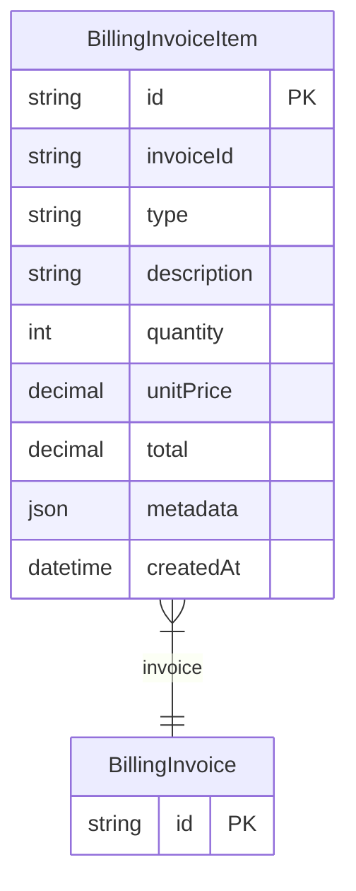

# BillingInvoiceItem

> Table name: `invoice_items`

**Schema location:** Lines 11398-11418

## Fields

| Field | Type | Required | Unique | Default | Notes |
|-------|------|----------|--------|---------|-------|
| `id` | `String` | ✅ | 🔑 PK | `` |  |
| `invoiceId` | `String` | ✅ |  | `` |  |
| `type` | `String` | ✅ |  | `` | 'SUBSCRIPTION', 'TOKENS', 'ADDON', 'PRORATION' |
| `description` | `String` | ✅ |  | `` |  |
| `quantity` | `Int` | ✅ |  | `1` |  |
| `unitPrice` | `Decimal` | ✅ |  | `` | DB: Decimal(12, 2) |
| `total` | `Decimal` | ✅ |  | `` | DB: Decimal(12, 2) |
| `metadata` | `Json?` | ❌ |  | `` |  |
| `createdAt` | `DateTime` | ✅ |  | `now(` |  |

## Relations

| Field | Type | Cardinality | FK Fields | References | On Delete |
|-------|------|-------------|-----------|------------|-----------|
| `invoice` | [BillingInvoice](./models/BillingInvoice.md) | Many-to-One | invoiceId | id | Cascade |

## Referenced By

| Model | Field | Cardinality |
|-------|-------|-------------|
| [BillingInvoice](./models/BillingInvoice.md) | `items` | Has many |

## Indexes

- `invoiceId`
- `type`

## Entity Diagram

