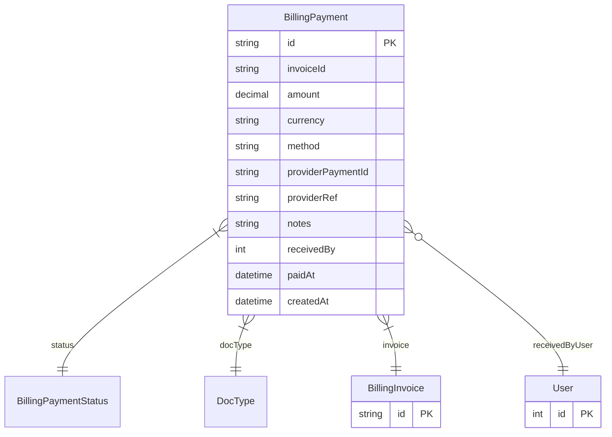

# BillingPayment

> Table name: `billing_payments`

**Schema location:** Lines 11421-11453

## Fields

| Field | Type | Required | Unique | Default | Notes |
|-------|------|----------|--------|---------|-------|
| `id` | `String` | ✅ | 🔑 PK | `` |  |
| `invoiceId` | `String` | ✅ |  | `` |  |
| `amount` | `Decimal` | ✅ |  | `` | DB: Decimal(12, 2) |
| `currency` | `String` | ✅ |  | `"ARS"` |  |
| `method` | `String` | ✅ |  | `` | 'CASH', 'TRANSFER', 'CARD', 'MERCADOPAGO', 'STRIPE' |
| `providerPaymentId` | `String?` | ❌ |  | `` | Provider (Stripe/MP) |
| `providerRef` | `String?` | ❌ |  | `` |  |
| `notes` | `String?` | ❌ |  | `` | Datos adicionales |
| `receivedBy` | `Int?` | ❌ |  | `` |  |
| `paidAt` | `DateTime?` | ❌ |  | `` |  |
| `createdAt` | `DateTime` | ✅ |  | `now(` |  |

## Relations

| Field | Type | Cardinality | FK Fields | References | On Delete |
|-------|------|-------------|-----------|------------|-----------|
| `status` | [BillingPaymentStatus](./models/BillingPaymentStatus.md) | Many-to-One | - | - | - |
| `docType` | [DocType](./models/DocType.md) | Many-to-One | - | - | - |
| `invoice` | [BillingInvoice](./models/BillingInvoice.md) | Many-to-One | invoiceId | id | Cascade |
| `receivedByUser` | [User](./models/User.md) | Many-to-One (optional) | receivedBy | id | - |

## Referenced By

| Model | Field | Cardinality |
|-------|-------|-------------|
| [User](./models/User.md) | `billingPaymentsReceived` | Has many |
| [BillingInvoice](./models/BillingInvoice.md) | `payments` | Has many |

## Indexes

- `invoiceId`
- `status`

## Entity Diagram

