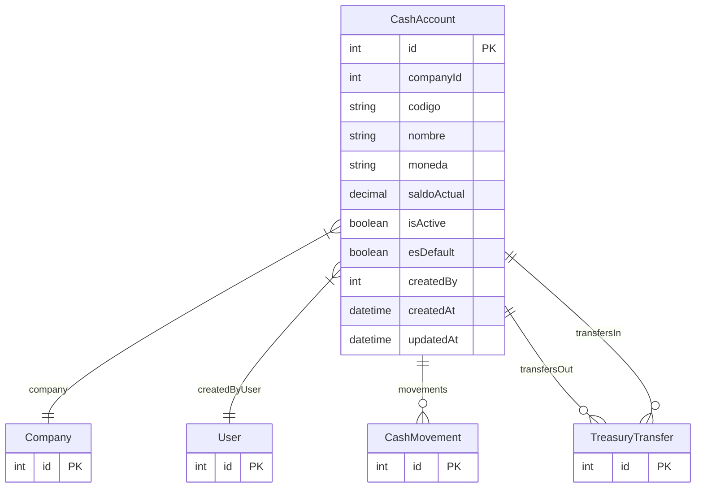

# CashAccount

> Table name: `cash_accounts`

**Schema location:** Lines 10651-10681

## Fields

| Field | Type | Required | Unique | Default | Notes |
|-------|------|----------|--------|---------|-------|
| `id` | `Int` | ✅ | 🔑 PK | `autoincrement(` |  |
| `companyId` | `Int` | ✅ |  | `` |  |
| `codigo` | `String` | ✅ |  | `` | DB: VarChar(20) |
| `nombre` | `String` | ✅ |  | `` | DB: VarChar(100) |
| `moneda` | `String` | ✅ |  | `"ARS"` | DB: VarChar(3). ARS, USD |
| `saldoActual` | `Decimal` | ✅ |  | `0` | DB: Decimal(15, 2). Saldo calculado |
| `isActive` | `Boolean` | ✅ |  | `true` | Config |
| `esDefault` | `Boolean` | ✅ |  | `false` | Caja por defecto |
| `createdBy` | `Int` | ✅ |  | `` | Auditoría |
| `createdAt` | `DateTime` | ✅ |  | `now(` |  |
| `updatedAt` | `DateTime` | ✅ |  | `` |  |

## Relations

| Field | Type | Cardinality | FK Fields | References | On Delete |
|-------|------|-------------|-----------|------------|-----------|
| `company` | [Company](./models/Company.md) | Many-to-One | companyId | id | Cascade |
| `createdByUser` | [User](./models/User.md) | Many-to-One | createdBy | id | - |
| `movements` | [CashMovement](./models/CashMovement.md) | One-to-Many | - | - | - |
| `transfersOut` | [TreasuryTransfer](./models/TreasuryTransfer.md) | One-to-Many | - | - | - |
| `transfersIn` | [TreasuryTransfer](./models/TreasuryTransfer.md) | One-to-Many | - | - | - |

## Referenced By

| Model | Field | Cardinality |
|-------|-------|-------------|
| [Company](./models/Company.md) | `cashAccounts` | Has many |
| [User](./models/User.md) | `cashAccountsCreated` | Has many |
| [CashMovement](./models/CashMovement.md) | `cashAccount` | Has one |
| [TreasuryTransfer](./models/TreasuryTransfer.md) | `origenCaja` | Has one |
| [TreasuryTransfer](./models/TreasuryTransfer.md) | `destinoCaja` | Has one |

## Indexes

- `companyId`
- `isActive`

## Unique Constraints

- `companyId, codigo`

## Entity Diagram

