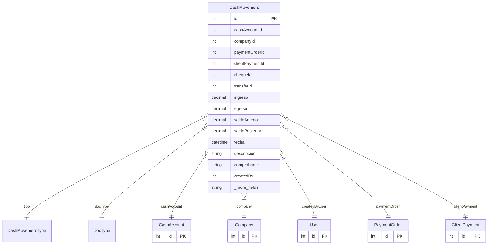

# CashMovement

> Table name: `cash_movements`

**Schema location:** Lines 10684-10727

## Fields

| Field | Type | Required | Unique | Default | Notes |
|-------|------|----------|--------|---------|-------|
| `id` | `Int` | ✅ | 🔑 PK | `autoincrement(` |  |
| `cashAccountId` | `Int` | ✅ |  | `` |  |
| `companyId` | `Int` | ✅ |  | `` |  |
| `paymentOrderId` | `Int?` | ❌ |  | `` | Pago a proveedor |
| `clientPaymentId` | `Int?` | ❌ |  | `` | Cobro de cliente |
| `chequeId` | `Int?` | ❌ |  | `` | Depósito/retiro de cheque |
| `transferId` | `Int?` | ❌ |  | `` | Transferencia interna |
| `ingreso` | `Decimal` | ✅ |  | `0` | DB: Decimal(15, 2). Montos |
| `egreso` | `Decimal` | ✅ |  | `0` | DB: Decimal(15, 2) |
| `saldoAnterior` | `Decimal` | ✅ |  | `` | DB: Decimal(15, 2) |
| `saldoPosterior` | `Decimal` | ✅ |  | `` | DB: Decimal(15, 2) |
| `fecha` | `DateTime` | ✅ |  | `` | DB: Date. Info |
| `descripcion` | `String?` | ❌ |  | `` |  |
| `comprobante` | `String?` | ❌ |  | `` | DB: VarChar(100) |
| `createdBy` | `Int` | ✅ |  | `` | Auditoría |
| `createdAt` | `DateTime` | ✅ |  | `now(` |  |

## Relations

| Field | Type | Cardinality | FK Fields | References | On Delete |
|-------|------|-------------|-----------|------------|-----------|
| `tipo` | [CashMovementType](./models/CashMovementType.md) | Many-to-One | - | - | - |
| `docType` | [DocType](./models/DocType.md) | Many-to-One | - | - | - |
| `cashAccount` | [CashAccount](./models/CashAccount.md) | Many-to-One | cashAccountId | id | Cascade |
| `company` | [Company](./models/Company.md) | Many-to-One | companyId | id | Cascade |
| `createdByUser` | [User](./models/User.md) | Many-to-One | createdBy | id | - |
| `paymentOrder` | [PaymentOrder](./models/PaymentOrder.md) | Many-to-One (optional) | paymentOrderId | id | - |
| `clientPayment` | [ClientPayment](./models/ClientPayment.md) | Many-to-One (optional) | clientPaymentId | id | - |

## Referenced By

| Model | Field | Cardinality |
|-------|-------|-------------|
| [Company](./models/Company.md) | `cashMovements` | Has many |
| [User](./models/User.md) | `cashMovementsCreated` | Has many |
| [PaymentOrder](./models/PaymentOrder.md) | `cashMovements` | Has many |
| [ClientPayment](./models/ClientPayment.md) | `cashMovements` | Has many |
| [CashAccount](./models/CashAccount.md) | `movements` | Has many |

## Indexes

- `cashAccountId`
- `companyId`
- `fecha`
- `tipo`
- `docType`

## Entity Diagram

