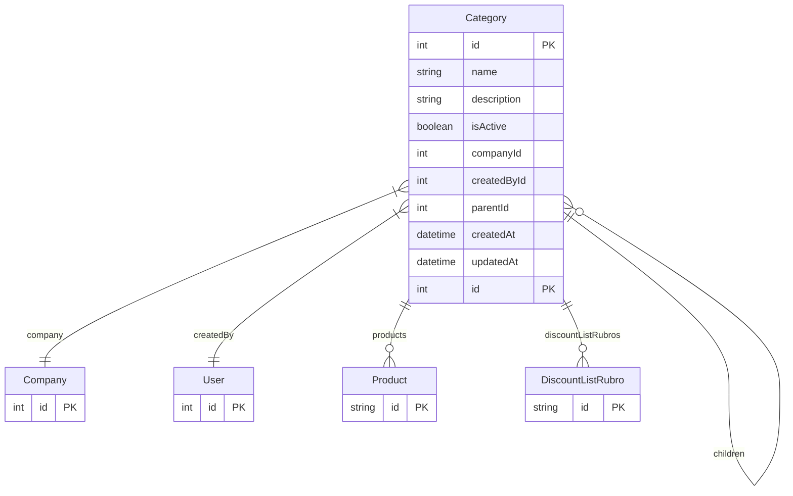

# Category

> Table name: `Category`

**Schema location:** Lines 2282-2302

## Fields

| Field | Type | Required | Unique | Default | Notes |
|-------|------|----------|--------|---------|-------|
| `id` | `Int` | ✅ | 🔑 PK | `autoincrement(` |  |
| `name` | `String` | ✅ |  | `` |  |
| `description` | `String?` | ❌ |  | `` |  |
| `isActive` | `Boolean` | ✅ |  | `true` |  |
| `companyId` | `Int` | ✅ |  | `` |  |
| `createdById` | `Int` | ✅ |  | `` |  |
| `parentId` | `Int?` | ❌ |  | `` | Para subcategorias |
| `createdAt` | `DateTime` | ✅ |  | `now(` |  |
| `updatedAt` | `DateTime` | ✅ |  | `` |  |

## Relations

| Field | Type | Cardinality | FK Fields | References | On Delete |
|-------|------|-------------|-----------|------------|-----------|
| `company` | [Company](./models/Company.md) | Many-to-One | companyId | id | Cascade |
| `createdBy` | [User](./models/User.md) | Many-to-One | createdById | id | - |
| `parent` | [Category](./models/Category.md) | Many-to-One (optional) | parentId | id | SetNull |
| `children` | [Category](./models/Category.md) | One-to-Many | - | - | - |
| `products` | [Product](./models/Product.md) | One-to-Many | - | - | - |
| `discountListRubros` | [DiscountListRubro](./models/DiscountListRubro.md) | One-to-Many | - | - | - |

## Referenced By

| Model | Field | Cardinality |
|-------|-------|-------------|
| [Company](./models/Company.md) | `categories` | Has many |
| [User](./models/User.md) | `createdCategories` | Has many |
| [Product](./models/Product.md) | `category` | Has one |
| [DiscountListRubro](./models/DiscountListRubro.md) | `category` | Has one |

## Indexes

- `parentId`

## Unique Constraints

- `companyId, name`

## Entity Diagram

