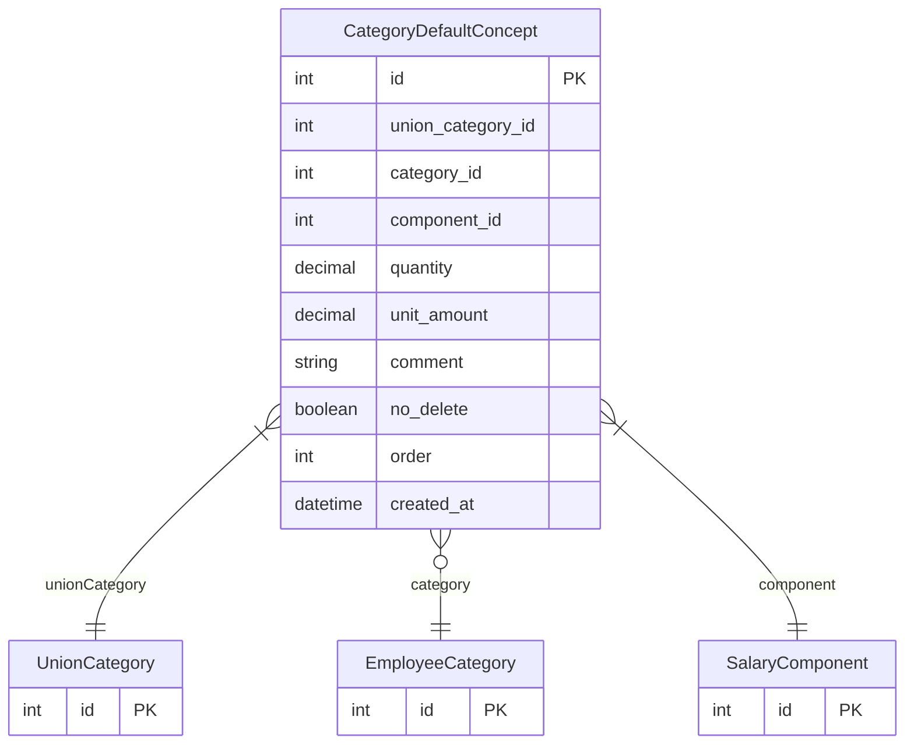

# CategoryDefaultConcept

> Table name: `category_default_concepts`

**Schema location:** Lines 12122-12143

## Fields

| Field | Type | Required | Unique | Default | Notes |
|-------|------|----------|--------|---------|-------|
| `id` | `Int` | ✅ | 🔑 PK | `autoincrement(` |  |
| `union_category_id` | `Int` | ✅ |  | `` | Nueva FK a UnionCategory |
| `category_id` | `Int?` | ❌ |  | `` | Legacy FK a EmployeeCategory (deprecated) |
| `component_id` | `Int` | ✅ |  | `` |  |
| `quantity` | `Decimal` | ✅ |  | `1` | DB: Decimal(10, 2) |
| `unit_amount` | `Decimal` | ✅ |  | `0` | DB: Decimal(12, 2) |
| `comment` | `String?` | ❌ |  | `` | DB: VarChar(500) |
| `no_delete` | `Boolean` | ✅ |  | `false` | Concepto obligatorio |
| `order` | `Int` | ✅ |  | `0` |  |
| `created_at` | `DateTime` | ✅ |  | `now(` |  |

## Relations

| Field | Type | Cardinality | FK Fields | References | On Delete |
|-------|------|-------------|-----------|------------|-----------|
| `unionCategory` | [UnionCategory](./models/UnionCategory.md) | Many-to-One | union_category_id | id | Cascade |
| `category` | [EmployeeCategory](./models/EmployeeCategory.md) | Many-to-One (optional) | category_id | id | SetNull |
| `component` | [SalaryComponent](./models/SalaryComponent.md) | Many-to-One | component_id | id | Cascade |

## Referenced By

| Model | Field | Cardinality |
|-------|-------|-------------|
| [EmployeeCategory](./models/EmployeeCategory.md) | `defaultConcepts` | Has many |
| [SalaryComponent](./models/SalaryComponent.md) | `categoryDefaults` | Has many |
| [UnionCategory](./models/UnionCategory.md) | `defaultConcepts` | Has many |

## Indexes

- `union_category_id`
- `category_id`

## Unique Constraints

- `union_category_id, component_id`

## Entity Diagram

