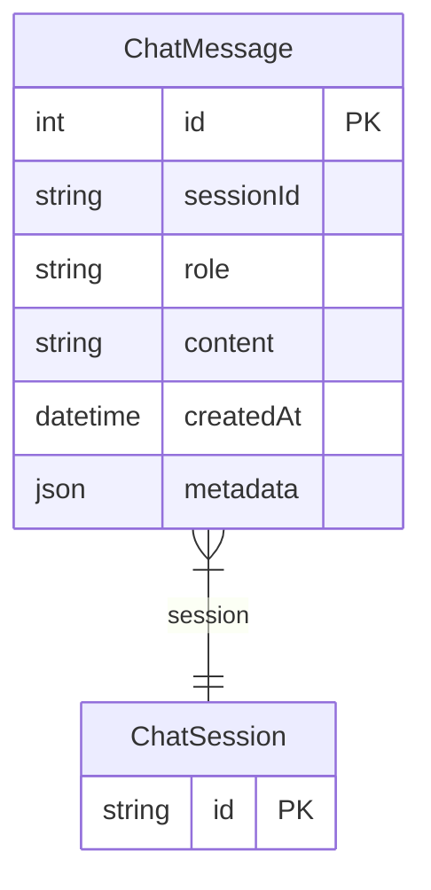

# ChatMessage

> Table name: `chat_messages`

**Schema location:** Lines 15465-15478

## Fields

| Field | Type | Required | Unique | Default | Notes |
|-------|------|----------|--------|---------|-------|
| `id` | `Int` | ✅ | 🔑 PK | `autoincrement(` |  |
| `sessionId` | `String` | ✅ |  | `` | DB: VarChar(255) |
| `role` | `String` | ✅ |  | `` | DB: VarChar(20) |
| `content` | `String` | ✅ |  | `` | DB: Text |
| `createdAt` | `DateTime` | ✅ |  | `now(` |  |
| `metadata` | `Json` | ✅ |  | `"{}"` | DB: JsonB |

## Relations

| Field | Type | Cardinality | FK Fields | References | On Delete |
|-------|------|-------------|-----------|------------|-----------|
| `session` | [ChatSession](./models/ChatSession.md) | Many-to-One | sessionId | id | Cascade |

## Referenced By

| Model | Field | Cardinality |
|-------|-------|-------------|
| [ChatSession](./models/ChatSession.md) | `messages` | Has many |

## Indexes

- `sessionId`
- `createdAt(sort: Desc)`

## Entity Diagram

