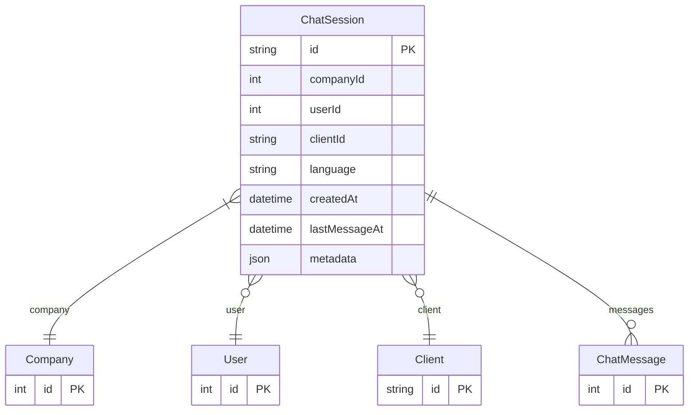

# ChatSession

> Table name: `chat_sessions`

**Schema location:** Lines 15443-15463

## Fields

| Field | Type | Required | Unique | Default | Notes |
|-------|------|----------|--------|---------|-------|
| `id` | `String` | ✅ | 🔑 PK | `` | DB: VarChar(255) |
| `companyId` | `Int` | ✅ |  | `` |  |
| `userId` | `Int?` | ❌ |  | `` |  |
| `clientId` | `String?` | ❌ |  | `` |  |
| `language` | `String` | ✅ |  | `"es"` | DB: VarChar(10) |
| `createdAt` | `DateTime` | ✅ |  | `now(` |  |
| `lastMessageAt` | `DateTime` | ✅ |  | `now(` |  |
| `metadata` | `Json` | ✅ |  | `"{}"` | DB: JsonB |

## Relations

| Field | Type | Cardinality | FK Fields | References | On Delete |
|-------|------|-------------|-----------|------------|-----------|
| `company` | [Company](./models/Company.md) | Many-to-One | companyId | id | Cascade |
| `user` | [User](./models/User.md) | Many-to-One (optional) | userId | id | SetNull |
| `client` | [Client](./models/Client.md) | Many-to-One (optional) | clientId | id | SetNull |
| `messages` | [ChatMessage](./models/ChatMessage.md) | One-to-Many | - | - | - |

## Referenced By

| Model | Field | Cardinality |
|-------|-------|-------------|
| [Company](./models/Company.md) | `chatSessions` | Has many |
| [User](./models/User.md) | `chatSessions` | Has many |
| [Client](./models/Client.md) | `chatSessions` | Has many |
| [ChatMessage](./models/ChatMessage.md) | `session` | Has one |

## Indexes

- `companyId`
- `userId`
- `clientId`
- `lastMessageAt(sort: Desc)`

## Entity Diagram

