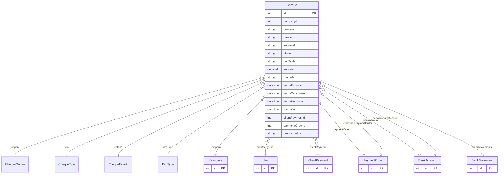

# Cheque

> Table name: `cheques`

**Schema location:** Lines 10826-10893

## Fields

| Field | Type | Required | Unique | Default | Notes |
|-------|------|----------|--------|---------|-------|
| `id` | `Int` | ✅ | 🔑 PK | `autoincrement(` |  |
| `companyId` | `Int` | ✅ |  | `` |  |
| `numero` | `String` | ✅ |  | `` | DB: VarChar(50). Datos del cheque |
| `banco` | `String` | ✅ |  | `` | DB: VarChar(100) |
| `sucursal` | `String?` | ❌ |  | `` | DB: VarChar(50) |
| `titular` | `String` | ✅ |  | `` | DB: VarChar(255) |
| `cuitTitular` | `String?` | ❌ |  | `` | DB: VarChar(20) |
| `importe` | `Decimal` | ✅ |  | `` | DB: Decimal(15, 2). Montos |
| `moneda` | `String` | ✅ |  | `"ARS"` | DB: VarChar(3) |
| `fechaEmision` | `DateTime` | ✅ |  | `` | DB: Date. Fechas |
| `fechaVencimiento` | `DateTime` | ✅ |  | `` | DB: Date |
| `fechaDeposito` | `DateTime?` | ❌ |  | `` | DB: Date |
| `fechaCobro` | `DateTime?` | ❌ |  | `` | DB: Date |
| `clientPaymentId` | `Int?` | ❌ |  | `` | Si es RECIBIDO de cliente |
| `paymentOrderId` | `Int?` | ❌ |  | `` | Si es EMITIDO a proveedor |
| `bankAccountId` | `Int?` | ❌ |  | `` | Cuenta bancaria de origen (chequera) |
| `depositoBankAccountId` | `Int?` | ❌ |  | `` | En qué banco se depositó |
| `endosadoA` | `String?` | ❌ |  | `` | DB: VarChar(255). Si fue endosado |
| `endosadoPaymentOrderId` | `Int?` | ❌ |  | `` | A qué pago se endosó |
| `motivoRechazo` | `String?` | ❌ |  | `` | Motivo rechazo si aplica |
| `createdBy` | `Int` | ✅ |  | `` | Auditoría |
| `createdAt` | `DateTime` | ✅ |  | `now(` |  |
| `updatedAt` | `DateTime` | ✅ |  | `` |  |

## Relations

| Field | Type | Cardinality | FK Fields | References | On Delete |
|-------|------|-------------|-----------|------------|-----------|
| `origen` | [ChequeOrigen](./models/ChequeOrigen.md) | Many-to-One | - | - | - |
| `tipo` | [ChequeTipo](./models/ChequeTipo.md) | Many-to-One | - | - | - |
| `estado` | [ChequeEstado](./models/ChequeEstado.md) | Many-to-One | - | - | - |
| `docType` | [DocType](./models/DocType.md) | Many-to-One | - | - | - |
| `company` | [Company](./models/Company.md) | Many-to-One | companyId | id | Cascade |
| `createdByUser` | [User](./models/User.md) | Many-to-One | createdBy | id | - |
| `clientPayment` | [ClientPayment](./models/ClientPayment.md) | Many-to-One (optional) | clientPaymentId | id | - |
| `paymentOrder` | [PaymentOrder](./models/PaymentOrder.md) | Many-to-One (optional) | paymentOrderId | id | - |
| `bankAccount` | [BankAccount](./models/BankAccount.md) | Many-to-One (optional) | bankAccountId | id | - |
| `depositoBankAccount` | [BankAccount](./models/BankAccount.md) | Many-to-One (optional) | depositoBankAccountId | id | - |
| `endosadoPaymentOrder` | [PaymentOrder](./models/PaymentOrder.md) | Many-to-One (optional) | endosadoPaymentOrderId | id | - |
| `bankMovements` | [BankMovement](./models/BankMovement.md) | One-to-Many | - | - | - |

## Referenced By

| Model | Field | Cardinality |
|-------|-------|-------------|
| [Company](./models/Company.md) | `cheques` | Has many |
| [User](./models/User.md) | `chequesCreated` | Has many |
| [PaymentOrder](./models/PaymentOrder.md) | `chequesEmitidos` | Has many |
| [PaymentOrder](./models/PaymentOrder.md) | `chequesEndosados` | Has many |
| [ClientPayment](./models/ClientPayment.md) | `chequesRecibidos` | Has many |
| [BankAccount](./models/BankAccount.md) | `cheques` | Has many |
| [BankAccount](./models/BankAccount.md) | `chequesDeposit` | Has many |
| [BankMovement](./models/BankMovement.md) | `cheque` | Has one |

## Indexes

- `companyId`
- `estado`
- `fechaVencimiento`
- `origen`
- `docType`

## Entity Diagram

