# Client

> Table name: `Client`

**Schema location:** Lines 4228-4395

## Fields

| Field | Type | Required | Unique | Default | Notes |
|-------|------|----------|--------|---------|-------|
| `id` | `String` | ✅ | 🔑 PK | `cuid(` |  |
| `name` | `String?` | ❌ |  | `` |  |
| `email` | `String` | ✅ |  | `` |  |
| `phone` | `String?` | ❌ |  | `` |  |
| `address` | `String?` | ❌ |  | `` |  |
| `cuit` | `String?` | ❌ |  | `` |  |
| `taxCondition` | `String` | ✅ |  | `"consumidor_final"` |  |
| `creditLimit` | `Float?` | ❌ |  | `` |  |
| `currentBalance` | `Float` | ✅ |  | `0` |  |
| `paymentTerms` | `Int?` | ❌ |  | `0` |  |
| `isActive` | `Boolean` | ✅ |  | `true` |  |
| `observations` | `String?` | ❌ |  | `` |  |
| `companyId` | `Int` | ✅ |  | `` |  |
| `createdAt` | `DateTime` | ✅ |  | `now(` |  |
| `updatedAt` | `DateTime` | ✅ |  | `` |  |
| `legalName` | `String` | ✅ |  | `` |  |
| `alternatePhone` | `String?` | ❌ |  | `` |  |
| `city` | `String?` | ❌ |  | `` |  |
| `province` | `String?` | ❌ |  | `` |  |
| `postalCode` | `String` | ✅ |  | `` |  |
| `checkTerms` | `Int?` | ❌ |  | `` |  |
| `saleCondition` | `String?` | ❌ |  | `` |  |
| `contactPerson` | `String?` | ❌ |  | `` |  |
| `grossIncome` | `String?` | ❌ |  | `` |  |
| `activityStartDate` | `DateTime?` | ❌ |  | `` |  |
| `merchandisePendingDays` | `Int?` | ❌ |  | `` |  |
| `sellerId` | `Int?` | ❌ |  | `` |  |
| `clientTypeId` | `String?` | ❌ |  | `` | Clasificación del cliente |
| `deliveryZoneId` | `String?` | ❌ |  | `` |  |
| `isBlocked` | `Boolean` | ✅ |  | `false` | Sistema de Bloqueo (para control de crédito) |
| `blockedReason` | `String?` | ❌ |  | `` |  |
| `blockedAt` | `DateTime?` | ❌ |  | `` |  |
| `blockedByUserId` | `Int?` | ❌ |  | `` |  |
| `porcentajeFormal` | `Decimal?` | ❌ |  | `` | DB: Decimal(5, 2). Solo para MIXTO (ej: 60.00) |
| `limiteAcopio` | `Decimal?` | ❌ |  | `` | DB: Decimal(15, 2). Máximo en acopio |
| `acopioActual` | `Decimal` | ✅ |  | `0` | DB: Decimal(15, 2). Saldo actual en acopio |
| `diasAlertaAcopio` | `Int?` | ❌ |  | `` | Días antes de vencimiento para alertar |
| `transportCompanyId` | `String?` | ❌ |  | `` | FK a TransportCompany |
| `businessSectorId` | `String?` | ❌ |  | `` | FK a BusinessSector |
| `requiresPurchaseOrder` | `Boolean` | ✅ |  | `false` | Exige orden de compra |
| `isDeliveryBlocked` | `Boolean` | ✅ |  | `false` | Bloqueado para entregas |
| `deliveryBlockedReason` | `String?` | ❌ |  | `` | Razón del bloqueo de entregas |
| `deliveryBlockedAt` | `DateTime?` | ❌ |  | `` | Fecha de bloqueo de entregas |
| `quickNote` | `String?` | ❌ |  | `` | Nota rápida visible en ventas |
| `quickNoteExpiry` | `DateTime?` | ❌ |  | `` | Fecha de vencimiento de la nota |
| `hasCheckLimit` | `Boolean` | ✅ |  | `false` | Tiene tope de cheques |
| `checkLimitType` | `String?` | ❌ |  | `` | Tipo de tope: 'CANTIDAD' o 'SALDO' |
| `checkLimit` | `Decimal?` | ❌ |  | `` | DB: Decimal(15, 2). Tope de cheques |
| `generalDiscount` | `Decimal?` | ❌ |  | `` | DB: Decimal(5, 2). Descuento general (%) - OBSOLETO, usar discountListId |
| `creditLimitOverride` | `Decimal?` | ❌ |  | `` | DB: Decimal(15, 2). Override temporal límite crédito |
| `creditLimitOverrideExpiry` | `DateTime?` | ❌ |  | `` | Fecha expiración override |
| `merchandisePendingDaysOverride` | `Int?` | ❌ |  | `` | Override temporal días mercadería pendiente |
| `merchandisePendingDaysOverrideExpiry` | `DateTime?` | ❌ |  | `` | Fecha expiración override |
| `tempCreditLimit` | `Decimal?` | ❌ |  | `` | DB: Decimal(15, 2). Límite crédito temporal (valor base) |
| `tempCreditLimitOverride` | `Decimal?` | ❌ |  | `` | DB: Decimal(15, 2). Override temporal del límite temporal |
| `tempCreditLimitOverrideExpiry` | `DateTime?` | ❌ |  | `` | Fecha expiración override |
| `invoiceDueDays` | `Int?` | ❌ |  | `15` | Vencimiento facturas por defecto (días) |
| `accountBlockDays` | `Int?` | ❌ |  | `` | Días inactividad para bloquear cta cte |
| `extraBonusDescription` | `String?` | ❌ |  | `` | Bonificación extra (ej: "10% por pago en 30 días") |
| `discountListId` | `String?` | ❌ |  | `` | FK a DiscountList |
| `defaultPriceListId` | `Int?` | ❌ |  | `` | FK a SalesPriceList |
| `whatsapp` | `String?` | ❌ |  | `` | Número de WhatsApp |
| `municipalRetentionType` | `String?` | ❌ |  | `` | Tipo retención municipal (CONVENIO_MULTILATERAL, LOCAL, EXENTO, NO_APLICA) |
| `parentClientId` | `String?` | ❌ |  | `` | FK a Client padre |
| `visitDays` | `Json?` | ❌ |  | `"[]"` | ["LUNES", "MARTES", ...] |
| `deliveryDays` | `Json?` | ❌ |  | `"[]"` | ["LUNES", "MARTES", ...] |
| `isVatPerceptionExempt` | `Boolean` | ✅ |  | `false` | Exento percepción IVA |
| `vatPerceptionExemptUntil` | `DateTime?` | ❌ |  | `` | Fecha hasta exención |
| `vatPerceptionExemptCertificate` | `String?` | ❌ |  | `` | Nro certificado exención |
| `isVatRetentionExempt` | `Boolean` | ✅ |  | `false` | Exento retención IVA |
| `vatRetentionExemptUntil` | `DateTime?` | ❌ |  | `` | Fecha hasta exención |
| `isGrossIncomeExempt` | `Boolean` | ✅ |  | `false` | Exento IIBB |
| `grossIncomeExemptUntil` | `DateTime?` | ❌ |  | `` | Fecha hasta exención |
| `isMunicipalExempt` | `Boolean` | ✅ |  | `false` | Exento municipal |
| `municipalExemptUntil` | `DateTime?` | ❌ |  | `` | Fecha hasta exención |

## Relations

| Field | Type | Cardinality | FK Fields | References | On Delete |
|-------|------|-------------|-----------|------------|-----------|
| `tipoCondicionVenta` | [SaleConditionType](./models/SaleConditionType.md) | Many-to-One | - | - | - |
| `settlementPeriod` | [SettlementPeriod](./models/SettlementPeriod.md) | Many-to-One (optional) | - | - | - |
| `company` | [Company](./models/Company.md) | Many-to-One | companyId | id | Cascade |
| `defaultPriceList` | [SalesPriceList](./models/SalesPriceList.md) | Many-to-One (optional) | defaultPriceListId | id | - |
| `seller` | [User](./models/User.md) | Many-to-One (optional) | sellerId | id | - |
| `clientType` | [ClientType](./models/ClientType.md) | Many-to-One (optional) | clientTypeId | id | - |
| `deliveryZone` | [DeliveryZone](./models/DeliveryZone.md) | Many-to-One (optional) | deliveryZoneId | id | - |
| `blockedByUser` | [User](./models/User.md) | Many-to-One (optional) | blockedByUserId | id | - |
| `transportCompany` | [TransportCompany](./models/TransportCompany.md) | Many-to-One (optional) | transportCompanyId | id | - |
| `businessSector` | [BusinessSector](./models/BusinessSector.md) | Many-to-One (optional) | businessSectorId | id | - |
| `discountList` | [DiscountList](./models/DiscountList.md) | Many-to-One (optional) | discountListId | id | - |
| `parentClient` | [Client](./models/Client.md) | Many-to-One (optional) | parentClientId | id | - |
| `subClients` | [Client](./models/Client.md) | One-to-Many | - | - | - |
| `discounts` | [ClientDiscount](./models/ClientDiscount.md) | One-to-Many | - | - | - |
| `priceLists` | [ClientPriceList](./models/ClientPriceList.md) | One-to-Many | - | - | - |
| `quotes` | [Quote](./models/Quote.md) | One-to-Many | - | - | - |
| `sales` | [Sale](./models/Sale.md) | One-to-Many | - | - | - |
| `deliveries` | [SaleDelivery](./models/SaleDelivery.md) | One-to-Many | - | - | - |
| `remitos` | [SaleRemito](./models/SaleRemito.md) | One-to-Many | - | - | - |
| `invoices` | [SalesInvoice](./models/SalesInvoice.md) | One-to-Many | - | - | - |
| `creditDebitNotes` | [SalesCreditDebitNote](./models/SalesCreditDebitNote.md) | One-to-Many | - | - | - |
| `payments` | [ClientPayment](./models/ClientPayment.md) | One-to-Many | - | - | - |
| `ledgerEntries` | [ClientLedgerEntry](./models/ClientLedgerEntry.md) | One-to-Many | - | - | - |
| `blockHistory` | [ClientBlockHistory](./models/ClientBlockHistory.md) | One-to-Many | - | - | - |
| `notes` | [ClientNote](./models/ClientNote.md) | One-to-Many | - | - | - |
| `portalAccess` | [ClientPortalAccess](./models/ClientPortalAccess.md) | One-to-Many | - | - | - |
| `contacts` | [ClientContact](./models/ClientContact.md) | One-to-Many | - | - | - |
| `portalUsers` | [ClientPortalUser](./models/ClientPortalUser.md) | One-to-Many | - | - | - |
| `portalOrders` | [ClientPortalOrder](./models/ClientPortalOrder.md) | One-to-Many | - | - | - |
| `acopios` | [SaleAcopio](./models/SaleAcopio.md) | One-to-Many | - | - | - |
| `chatSessions` | [ChatSession](./models/ChatSession.md) | One-to-Many | - | - | - |
| `rmas` | [SaleRMA](./models/SaleRMA.md) | One-to-Many | - | - | - |
| `warranties` | [ProductWarranty](./models/ProductWarranty.md) | One-to-Many | - | - | - |
| `balanceSnapshots` | [ClientBalanceSnapshot](./models/ClientBalanceSnapshot.md) | One-to-Many | - | - | - |

## Referenced By

| Model | Field | Cardinality |
|-------|-------|-------------|
| [Company](./models/Company.md) | `clients` | Has many |
| [User](./models/User.md) | `clientsSold` | Has many |
| [User](./models/User.md) | `clientsBlocked` | Has many |
| [ClientType](./models/ClientType.md) | `clients` | Has many |
| [DeliveryZone](./models/DeliveryZone.md) | `clients` | Has many |
| [TransportCompany](./models/TransportCompany.md) | `clients` | Has many |
| [BusinessSector](./models/BusinessSector.md) | `clients` | Has many |
| [ClientBlockHistory](./models/ClientBlockHistory.md) | `client` | Has one |
| [ClientNote](./models/ClientNote.md) | `client` | Has one |
| [ClientDiscount](./models/ClientDiscount.md) | `client` | Has one |
| [ClientPriceList](./models/ClientPriceList.md) | `client` | Has one |
| [DiscountList](./models/DiscountList.md) | `clients` | Has many |
| [Quote](./models/Quote.md) | `client` | Has one |
| [ClientPortalAccess](./models/ClientPortalAccess.md) | `client` | Has one |
| [ClientContact](./models/ClientContact.md) | `client` | Has one |
| [ClientPortalUser](./models/ClientPortalUser.md) | `client` | Has one |
| [ClientPortalOrder](./models/ClientPortalOrder.md) | `client` | Has one |
| [Sale](./models/Sale.md) | `client` | Has one |
| [SaleDelivery](./models/SaleDelivery.md) | `client` | Has one |
| [SaleRemito](./models/SaleRemito.md) | `client` | Has one |
| [SalesInvoice](./models/SalesInvoice.md) | `client` | Has one |
| [SalesCreditDebitNote](./models/SalesCreditDebitNote.md) | `client` | Has one |
| [ClientPayment](./models/ClientPayment.md) | `client` | Has one |
| [ClientLedgerEntry](./models/ClientLedgerEntry.md) | `client` | Has one |
| [SalesPriceList](./models/SalesPriceList.md) | `clients` | Has many |
| [SaleRMA](./models/SaleRMA.md) | `client` | Has one |
| [ProductWarranty](./models/ProductWarranty.md) | `client` | Has one |
| [SaleAcopio](./models/SaleAcopio.md) | `client` | Has one |
| [ChatSession](./models/ChatSession.md) | `client` | Has one |
| [ClientBalanceSnapshot](./models/ClientBalanceSnapshot.md) | `client` | Has one |

## Indexes

- `companyId`
- `isActive`
- `companyId, isActive`
- `name`
- `sellerId`
- `tipoCondicionVenta`
- `clientTypeId`
- `deliveryZoneId`
- `isBlocked`
- `transportCompanyId`
- `businessSectorId`
- `settlementPeriod`
- `isDeliveryBlocked`
- `quickNoteExpiry`
- `parentClientId`
- `isVatPerceptionExempt`

## Entity Diagram

```mermaid
erDiagram
    Client {
        string id PK
        string name
        string email
        string phone
        string address
        string cuit
        string taxCondition
        float creditLimit
        float currentBalance
        int paymentTerms
        boolean isActive
        string observations
        int companyId
        datetime createdAt
        datetime updatedAt
        string _more_fields
    }
    Company {
        int id PK
    }
    SalesPriceList {
        int id PK
    }
    User {
        int id PK
    }
    ClientType {
        string id PK
    }
    DeliveryZone {
        string id PK
    }
    TransportCompany {
        string id PK
    }
    BusinessSector {
        string id PK
    }
    DiscountList {
        string id PK
    }
    Client {
        string id PK
    }
    ClientDiscount {
        string id PK
    }
    ClientPriceList {
        string id PK
    }
    Quote {
        int id PK
    }
    Sale {
        int id PK
    }
    SaleDelivery {
        int id PK
    }
    SaleRemito {
        int id PK
    }
    SalesInvoice {
        int id PK
    }
    SalesCreditDebitNote {
        int id PK
    }
    ClientPayment {
        int id PK
    }
    ClientLedgerEntry {
        int id PK
    }
    ClientBlockHistory {
        string id PK
    }
    ClientNote {
        string id PK
    }
    ClientPortalAccess {
        int id PK
    }
    ClientContact {
        string id PK
    }
    ClientPortalUser {
        string id PK
    }
    ClientPortalOrder {
        string id PK
    }
    SaleAcopio {
        int id PK
    }
    ChatSession {
        string id PK
    }
    SaleRMA {
        string id PK
    }
    ProductWarranty {
        string id PK
    }
    ClientBalanceSnapshot {
        int id PK
    }
    Client }|--|| SaleConditionType : "tipoCondicionVenta"
    Client }o--|| SettlementPeriod : "settlementPeriod"
    Client }|--|| Company : "company"
    Client }o--|| SalesPriceList : "defaultPriceList"
    Client }o--|| User : "seller"
    Client }o--|| ClientType : "clientType"
    Client }o--|| DeliveryZone : "deliveryZone"
    Client }o--|| User : "blockedByUser"
    Client }o--|| TransportCompany : "transportCompany"
    Client }o--|| BusinessSector : "businessSector"
    Client }o--|| DiscountList : "discountList"
    Client }o--|| Client : "parentClient"
    Client ||--o{ Client : "subClients"
    Client ||--o{ ClientDiscount : "discounts"
    Client ||--o{ ClientPriceList : "priceLists"
    Client ||--o{ Quote : "quotes"
    Client ||--o{ Sale : "sales"
    Client ||--o{ SaleDelivery : "deliveries"
    Client ||--o{ SaleRemito : "remitos"
    Client ||--o{ SalesInvoice : "invoices"
    Client ||--o{ SalesCreditDebitNote : "creditDebitNotes"
    Client ||--o{ ClientPayment : "payments"
    Client ||--o{ ClientLedgerEntry : "ledgerEntries"
    Client ||--o{ ClientBlockHistory : "blockHistory"
    Client ||--o{ ClientNote : "notes"
    Client ||--o{ ClientPortalAccess : "portalAccess"
    Client ||--o{ ClientContact : "contacts"
    Client ||--o{ ClientPortalUser : "portalUsers"
    Client ||--o{ ClientPortalOrder : "portalOrders"
    Client ||--o{ SaleAcopio : "acopios"
    Client ||--o{ ChatSession : "chatSessions"
    Client ||--o{ SaleRMA : "rmas"
    Client ||--o{ ProductWarranty : "warranties"
    Client ||--o{ ClientBalanceSnapshot : "balanceSnapshots"
```

