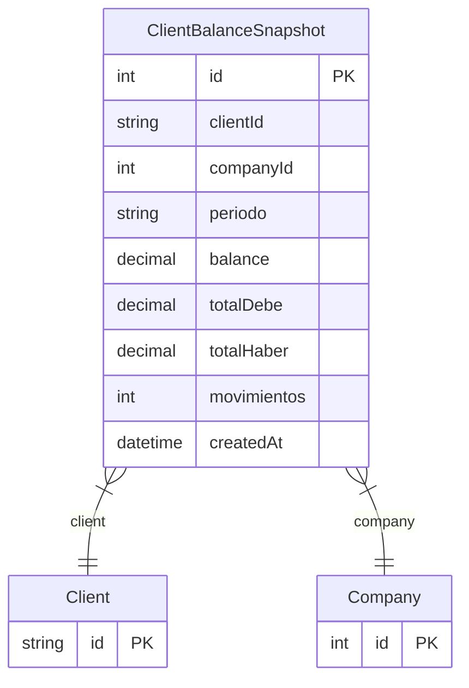

# ClientBalanceSnapshot

> Table name: `ClientBalanceSnapshot`

**Schema location:** Lines 15480-15498

## Fields

| Field | Type | Required | Unique | Default | Notes |
|-------|------|----------|--------|---------|-------|
| `id` | `Int` | ✅ | 🔑 PK | `autoincrement(` |  |
| `clientId` | `String` | ✅ |  | `` |  |
| `companyId` | `Int` | ✅ |  | `` |  |
| `periodo` | `String` | ✅ |  | `` | DB: VarChar(7). "YYYY-MM" |
| `balance` | `Decimal` | ✅ |  | `` | DB: Decimal(15, 2). Saldo al cierre del periodo |
| `totalDebe` | `Decimal` | ✅ |  | `0` | DB: Decimal(15, 2). Total facturado en el periodo |
| `totalHaber` | `Decimal` | ✅ |  | `0` | DB: Decimal(15, 2). Total cobrado + NC en el periodo |
| `movimientos` | `Int` | ✅ |  | `0` | Cantidad de movimientos en el periodo |
| `createdAt` | `DateTime` | ✅ |  | `now(` |  |

## Relations

| Field | Type | Cardinality | FK Fields | References | On Delete |
|-------|------|-------------|-----------|------------|-----------|
| `client` | [Client](./models/Client.md) | Many-to-One | clientId | id | Cascade |
| `company` | [Company](./models/Company.md) | Many-to-One | companyId | id | Cascade |

## Referenced By

| Model | Field | Cardinality |
|-------|-------|-------------|
| [Company](./models/Company.md) | `clientBalanceSnapshots` | Has many |
| [Client](./models/Client.md) | `balanceSnapshots` | Has many |

## Indexes

- `companyId, periodo`
- `clientId`

## Unique Constraints

- `clientId, companyId, periodo`

## Entity Diagram

