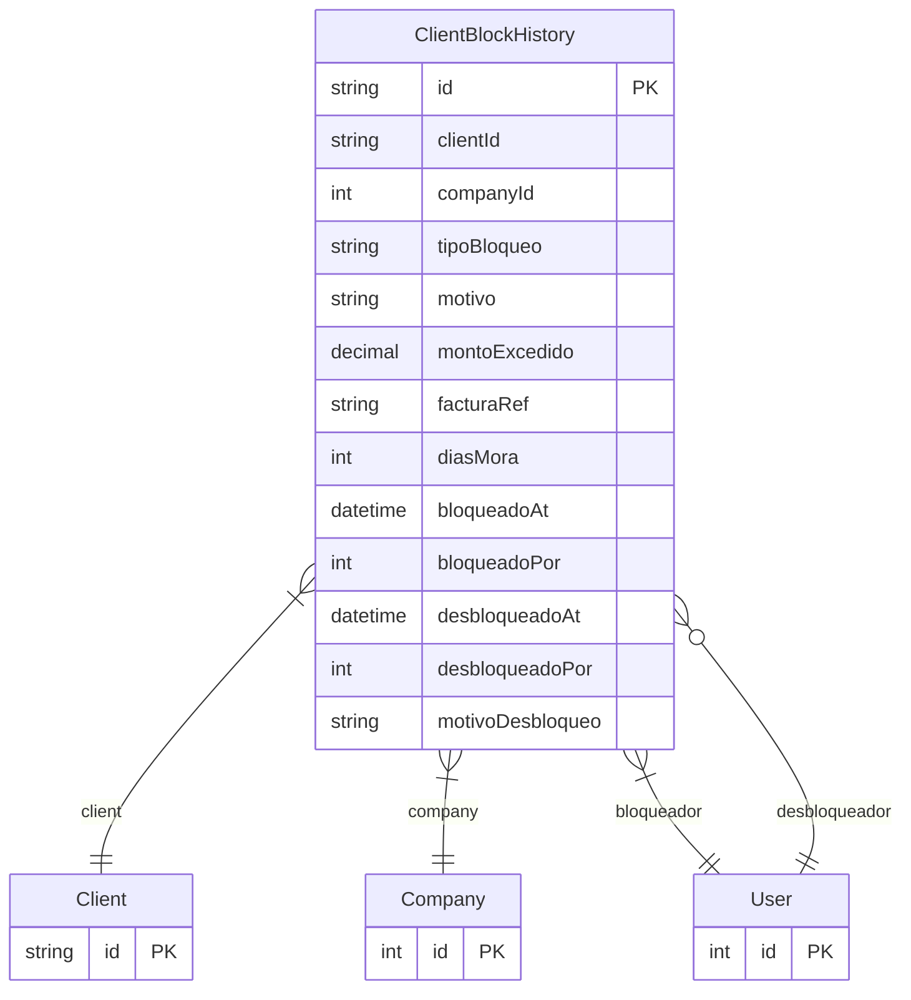

# ClientBlockHistory

> Table name: `ClientBlockHistory`

**Schema location:** Lines 4397-4422

## Fields

| Field | Type | Required | Unique | Default | Notes |
|-------|------|----------|--------|---------|-------|
| `id` | `String` | ✅ | 🔑 PK | `cuid(` |  |
| `clientId` | `String` | ✅ |  | `` |  |
| `companyId` | `Int` | ✅ |  | `` |  |
| `tipoBloqueo` | `String` | ✅ |  | `` | CREDITO, MORA, MANUAL, CHEQUE_RECHAZADO |
| `motivo` | `String` | ✅ |  | `` |  |
| `montoExcedido` | `Decimal?` | ❌ |  | `` | DB: Decimal(15, 2) |
| `facturaRef` | `String?` | ❌ |  | `` |  |
| `diasMora` | `Int?` | ❌ |  | `` |  |
| `bloqueadoAt` | `DateTime` | ✅ |  | `now(` |  |
| `bloqueadoPor` | `Int` | ✅ |  | `` |  |
| `desbloqueadoAt` | `DateTime?` | ❌ |  | `` |  |
| `desbloqueadoPor` | `Int?` | ❌ |  | `` |  |
| `motivoDesbloqueo` | `String?` | ❌ |  | `` |  |

## Relations

| Field | Type | Cardinality | FK Fields | References | On Delete |
|-------|------|-------------|-----------|------------|-----------|
| `client` | [Client](./models/Client.md) | Many-to-One | clientId | id | Cascade |
| `company` | [Company](./models/Company.md) | Many-to-One | companyId | id | Cascade |
| `bloqueador` | [User](./models/User.md) | Many-to-One | bloqueadoPor | id | - |
| `desbloqueador` | [User](./models/User.md) | Many-to-One (optional) | desbloqueadoPor | id | - |

## Referenced By

| Model | Field | Cardinality |
|-------|-------|-------------|
| [Company](./models/Company.md) | `clientBlockHistory` | Has many |
| [User](./models/User.md) | `clientBlocksCreated` | Has many |
| [User](./models/User.md) | `clientBlocksResolved` | Has many |
| [Client](./models/Client.md) | `blockHistory` | Has many |

## Indexes

- `clientId`
- `companyId`
- `bloqueadoAt`
- `desbloqueadoAt`

## Entity Diagram

