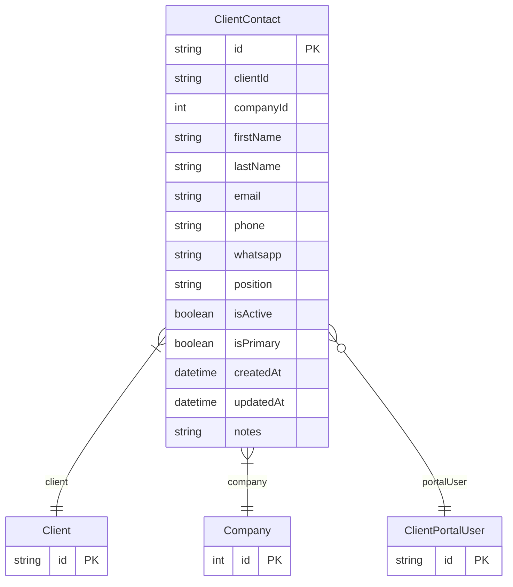

# ClientContact

> Table name: `client_contacts`

**Schema location:** Lines 8869-8901

## Fields

| Field | Type | Required | Unique | Default | Notes |
|-------|------|----------|--------|---------|-------|
| `id` | `String` | ✅ | 🔑 PK | `cuid(` |  |
| `clientId` | `String` | ✅ |  | `` |  |
| `companyId` | `Int` | ✅ |  | `` |  |
| `firstName` | `String` | ✅ |  | `` | DB: VarChar(100). Datos personales |
| `lastName` | `String` | ✅ |  | `` | DB: VarChar(100) |
| `email` | `String` | ✅ |  | `` | DB: VarChar(255) |
| `phone` | `String?` | ❌ |  | `` | DB: VarChar(50) |
| `whatsapp` | `String?` | ❌ |  | `` | DB: VarChar(50) |
| `position` | `String?` | ❌ |  | `` | DB: VarChar(100) |
| `isActive` | `Boolean` | ✅ |  | `true` | Estado |
| `isPrimary` | `Boolean` | ✅ |  | `false` |  |
| `createdAt` | `DateTime` | ✅ |  | `now(` | Metadata |
| `updatedAt` | `DateTime` | ✅ |  | `` |  |
| `notes` | `String?` | ❌ |  | `` |  |

## Relations

| Field | Type | Cardinality | FK Fields | References | On Delete |
|-------|------|-------------|-----------|------------|-----------|
| `client` | [Client](./models/Client.md) | Many-to-One | clientId | id | Cascade |
| `company` | [Company](./models/Company.md) | Many-to-One | companyId | id | - |
| `portalUser` | [ClientPortalUser](./models/ClientPortalUser.md) | Many-to-One (optional) | - | - | - |

## Referenced By

| Model | Field | Cardinality |
|-------|-------|-------------|
| [Company](./models/Company.md) | `clientContacts` | Has many |
| [Client](./models/Client.md) | `contacts` | Has many |
| [ClientPortalUser](./models/ClientPortalUser.md) | `contact` | Has one |

## Indexes

- `clientId`
- `companyId`
- `email`

## Unique Constraints

- `clientId, email`

## Entity Diagram

