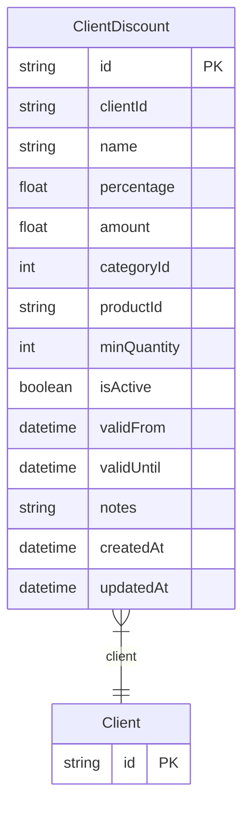

# ClientDiscount

> Table name: `ClientDiscount`

**Schema location:** Lines 4451-4471

## Fields

| Field | Type | Required | Unique | Default | Notes |
|-------|------|----------|--------|---------|-------|
| `id` | `String` | ✅ | 🔑 PK | `cuid(` |  |
| `clientId` | `String` | ✅ |  | `` |  |
| `name` | `String` | ✅ |  | `` |  |
| `percentage` | `Float?` | ❌ |  | `` |  |
| `amount` | `Float?` | ❌ |  | `` |  |
| `categoryId` | `Int?` | ❌ |  | `` |  |
| `productId` | `String?` | ❌ |  | `` |  |
| `minQuantity` | `Int?` | ❌ |  | `` |  |
| `isActive` | `Boolean` | ✅ |  | `true` |  |
| `validFrom` | `DateTime?` | ❌ |  | `` |  |
| `validUntil` | `DateTime?` | ❌ |  | `` |  |
| `notes` | `String?` | ❌ |  | `` |  |
| `createdAt` | `DateTime` | ✅ |  | `now(` |  |
| `updatedAt` | `DateTime` | ✅ |  | `` |  |

## Relations

| Field | Type | Cardinality | FK Fields | References | On Delete |
|-------|------|-------------|-----------|------------|-----------|
| `client` | [Client](./models/Client.md) | Many-to-One | clientId | id | Cascade |

## Referenced By

| Model | Field | Cardinality |
|-------|-------|-------------|
| [Client](./models/Client.md) | `discounts` | Has many |

## Indexes

- `clientId`
- `isActive`

## Entity Diagram

