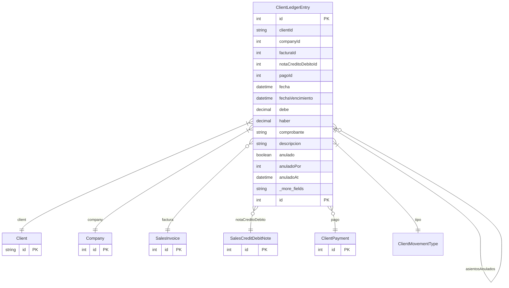

# ClientLedgerEntry

> Table name: `client_ledger_entries`

**Schema location:** Lines 9849-9906

## Fields

| Field | Type | Required | Unique | Default | Notes |
|-------|------|----------|--------|---------|-------|
| `id` | `Int` | ✅ | 🔑 PK | `autoincrement(` |  |
| `clientId` | `String` | ✅ |  | `` |  |
| `companyId` | `Int` | ✅ |  | `` |  |
| `facturaId` | `Int?` | ❌ |  | `` | Referencias a documentos |
| `notaCreditoDebitoId` | `Int?` | ❌ |  | `` |  |
| `pagoId` | `Int?` | ❌ |  | `` |  |
| `fecha` | `DateTime` | ✅ |  | `` | DB: Date. Fechas |
| `fechaVencimiento` | `DateTime?` | ❌ |  | `` | DB: Date |
| `debe` | `Decimal` | ✅ |  | `0` | DB: Decimal(15, 2). Montos (debe = aumenta deuda, haber = disminuye deuda) |
| `haber` | `Decimal` | ✅ |  | `0` | DB: Decimal(15, 2) |
| `comprobante` | `String?` | ❌ |  | `` | DB: VarChar(100). Información |
| `descripcion` | `String?` | ❌ |  | `` |  |
| `anulado` | `Boolean` | ✅ |  | `false` | Anulación (ledger inmutable - se anula con contraasiento) |
| `anuladoPor` | `Int?` | ❌ |  | `` |  |
| `anuladoAt` | `DateTime?` | ❌ |  | `` |  |
| `conciliado` | `Boolean` | ✅ |  | `false` | Conciliación (fase futura) |
| `conciliadoAt` | `DateTime?` | ❌ |  | `` |  |
| `conciliadoBy` | `Int?` | ❌ |  | `` |  |
| `createdBy` | `Int?` | ❌ |  | `` | Tracking |
| `createdAt` | `DateTime` | ✅ |  | `now(` |  |

## Relations

| Field | Type | Cardinality | FK Fields | References | On Delete |
|-------|------|-------------|-----------|------------|-----------|
| `tipo` | [ClientMovementType](./models/ClientMovementType.md) | Many-to-One | - | - | - |
| `client` | [Client](./models/Client.md) | Many-to-One | clientId | id | Cascade |
| `company` | [Company](./models/Company.md) | Many-to-One | companyId | id | Cascade |
| `factura` | [SalesInvoice](./models/SalesInvoice.md) | Many-to-One (optional) | facturaId | id | - |
| `notaCreditoDebito` | [SalesCreditDebitNote](./models/SalesCreditDebitNote.md) | Many-to-One (optional) | notaCreditoDebitoId | id | - |
| `pago` | [ClientPayment](./models/ClientPayment.md) | Many-to-One (optional) | pagoId | id | - |
| `asientoAnulacion` | [ClientLedgerEntry](./models/ClientLedgerEntry.md) | Many-to-One (optional) | anuladoPor | id | - |
| `asientosAnulados` | [ClientLedgerEntry](./models/ClientLedgerEntry.md) | One-to-Many | - | - | - |

## Referenced By

| Model | Field | Cardinality |
|-------|-------|-------------|
| [Company](./models/Company.md) | `clientLedgerEntries` | Has many |
| [Client](./models/Client.md) | `ledgerEntries` | Has many |
| [SalesInvoice](./models/SalesInvoice.md) | `ledgerEntries` | Has many |
| [SalesCreditDebitNote](./models/SalesCreditDebitNote.md) | `ledgerEntries` | Has many |
| [ClientPayment](./models/ClientPayment.md) | `ledgerEntries` | Has many |

## Indexes

- `clientId`
- `companyId`
- `fecha`
- `tipo`
- `anulado`
- `companyId, clientId`
- `companyId, clientId, fecha`
- `clientId, fecha`
- `companyId, anulado, tipo`

## Entity Diagram

