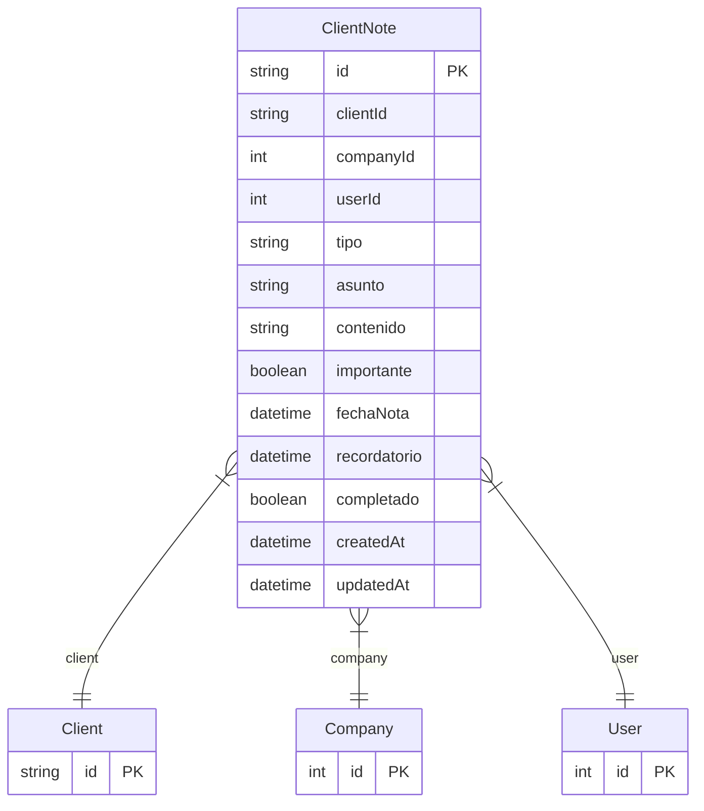

# ClientNote

> Table name: `ClientNote`

**Schema location:** Lines 4424-4449

## Fields

| Field | Type | Required | Unique | Default | Notes |
|-------|------|----------|--------|---------|-------|
| `id` | `String` | ✅ | 🔑 PK | `cuid(` |  |
| `clientId` | `String` | ✅ |  | `` |  |
| `companyId` | `Int` | ✅ |  | `` |  |
| `userId` | `Int` | ✅ |  | `` |  |
| `tipo` | `String` | ✅ |  | `` | LLAMADA, REUNION, EMAIL, RECLAMO, VISITA, NOTA, SEGUIMIENTO |
| `asunto` | `String` | ✅ |  | `` |  |
| `contenido` | `String` | ✅ |  | `` | DB: Text |
| `importante` | `Boolean` | ✅ |  | `false` |  |
| `fechaNota` | `DateTime` | ✅ |  | `now(` |  |
| `recordatorio` | `DateTime?` | ❌ |  | `` |  |
| `completado` | `Boolean` | ✅ |  | `false` |  |
| `createdAt` | `DateTime` | ✅ |  | `now(` |  |
| `updatedAt` | `DateTime` | ✅ |  | `` |  |

## Relations

| Field | Type | Cardinality | FK Fields | References | On Delete |
|-------|------|-------------|-----------|------------|-----------|
| `client` | [Client](./models/Client.md) | Many-to-One | clientId | id | Cascade |
| `company` | [Company](./models/Company.md) | Many-to-One | companyId | id | Cascade |
| `user` | [User](./models/User.md) | Many-to-One | userId | id | - |

## Referenced By

| Model | Field | Cardinality |
|-------|-------|-------------|
| [Company](./models/Company.md) | `clientNotes` | Has many |
| [User](./models/User.md) | `clientNotes` | Has many |
| [Client](./models/Client.md) | `notes` | Has many |

## Indexes

- `clientId`
- `companyId`
- `userId`
- `recordatorio`
- `fechaNota`

## Entity Diagram

