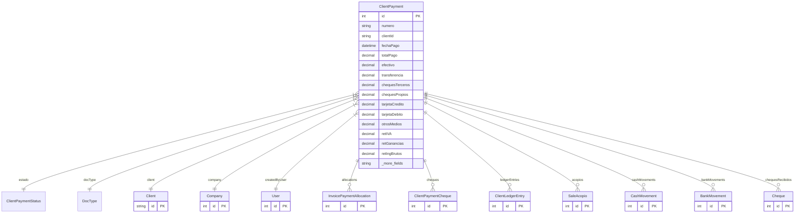

# ClientPayment

> Table name: `client_payments`

**Schema location:** Lines 9730-9809

## Fields

| Field | Type | Required | Unique | Default | Notes |
|-------|------|----------|--------|---------|-------|
| `id` | `Int` | ✅ | 🔑 PK | `autoincrement(` |  |
| `numero` | `String` | ✅ |  | `` | DB: VarChar(50) |
| `clientId` | `String` | ✅ |  | `` |  |
| `fechaPago` | `DateTime` | ✅ |  | `` | DB: Date |
| `totalPago` | `Decimal` | ✅ |  | `` | DB: Decimal(15, 2). Montos por método |
| `efectivo` | `Decimal` | ✅ |  | `0` | DB: Decimal(15, 2) |
| `transferencia` | `Decimal` | ✅ |  | `0` | DB: Decimal(15, 2) |
| `chequesTerceros` | `Decimal` | ✅ |  | `0` | DB: Decimal(15, 2) |
| `chequesPropios` | `Decimal` | ✅ |  | `0` | DB: Decimal(15, 2) |
| `tarjetaCredito` | `Decimal` | ✅ |  | `0` | DB: Decimal(15, 2) |
| `tarjetaDebito` | `Decimal` | ✅ |  | `0` | DB: Decimal(15, 2) |
| `otrosMedios` | `Decimal` | ✅ |  | `0` | DB: Decimal(15, 2) |
| `retIVA` | `Decimal` | ✅ |  | `0` | DB: Decimal(15, 2). Retenciones aplicadas |
| `retGanancias` | `Decimal` | ✅ |  | `0` | DB: Decimal(15, 2) |
| `retIngBrutos` | `Decimal` | ✅ |  | `0` | DB: Decimal(15, 2) |
| `motivoAnulacion` | `String?` | ❌ |  | `` | Anulación |
| `fechaAnulacion` | `DateTime?` | ❌ |  | `` |  |
| `anuladoPor` | `Int?` | ❌ |  | `` |  |
| `motivoRechazo` | `String?` | ❌ |  | `` | Rechazo (cheque rechazado, transferencia fallida, etc.) |
| `fechaRechazo` | `DateTime?` | ❌ |  | `` |  |
| `bancoOrigen` | `String?` | ❌ |  | `` | DB: VarChar(100). Datos bancarios |
| `numeroOperacion` | `String?` | ❌ |  | `` | DB: VarChar(50) |
| `notas` | `String?` | ❌ |  | `` | Notas |
| `mediosData` | `Json?` | ❌ |  | `` | Format: [{ tipo, monto, accountId, accountType, numeroComprobante, fechaAcreditacion, chequeData }] |
| `companyId` | `Int` | ✅ |  | `` | Tracking |
| `createdBy` | `Int` | ✅ |  | `` |  |
| `createdAt` | `DateTime` | ✅ |  | `now(` |  |
| `updatedAt` | `DateTime` | ✅ |  | `` |  |

## Relations

| Field | Type | Cardinality | FK Fields | References | On Delete |
|-------|------|-------------|-----------|------------|-----------|
| `estado` | [ClientPaymentStatus](./models/ClientPaymentStatus.md) | Many-to-One | - | - | - |
| `docType` | [DocType](./models/DocType.md) | Many-to-One | - | - | - |
| `client` | [Client](./models/Client.md) | Many-to-One | clientId | id | - |
| `company` | [Company](./models/Company.md) | Many-to-One | companyId | id | Cascade |
| `createdByUser` | [User](./models/User.md) | Many-to-One | createdBy | id | - |
| `allocations` | [InvoicePaymentAllocation](./models/InvoicePaymentAllocation.md) | One-to-Many | - | - | - |
| `cheques` | [ClientPaymentCheque](./models/ClientPaymentCheque.md) | One-to-Many | - | - | - |
| `ledgerEntries` | [ClientLedgerEntry](./models/ClientLedgerEntry.md) | One-to-Many | - | - | - |
| `acopios` | [SaleAcopio](./models/SaleAcopio.md) | One-to-Many | - | - | - |
| `cashMovements` | [CashMovement](./models/CashMovement.md) | One-to-Many | - | - | - |
| `bankMovements` | [BankMovement](./models/BankMovement.md) | One-to-Many | - | - | - |
| `chequesRecibidos` | [Cheque](./models/Cheque.md) | One-to-Many | - | - | - |

## Referenced By

| Model | Field | Cardinality |
|-------|-------|-------------|
| [Company](./models/Company.md) | `clientPayments` | Has many |
| [User](./models/User.md) | `clientPaymentsCreated` | Has many |
| [Client](./models/Client.md) | `payments` | Has many |
| [InvoicePaymentAllocation](./models/InvoicePaymentAllocation.md) | `payment` | Has one |
| [ClientPaymentCheque](./models/ClientPaymentCheque.md) | `payment` | Has one |
| [ClientLedgerEntry](./models/ClientLedgerEntry.md) | `pago` | Has one |
| [SaleAcopio](./models/SaleAcopio.md) | `payment` | Has one |
| [CashMovement](./models/CashMovement.md) | `clientPayment` | Has one |
| [BankMovement](./models/BankMovement.md) | `clientPayment` | Has one |
| [Cheque](./models/Cheque.md) | `clientPayment` | Has one |

## Indexes

- `companyId`
- `clientId`
- `fechaPago`
- `estado`
- `docType`
- `companyId, docType`
- `companyId, docType, fechaPago`
- `companyId, clientId, estado`
- `clientId, estado, fechaPago`

## Unique Constraints

- `companyId, numero`

## Entity Diagram

